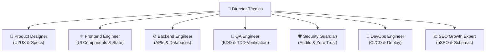

# 👔 Departamento: Dirección Técnica (DT & Arquitectura)

## 1. Misión del Rol
El Director Técnico (DT) es el orquestador supremo de ingeniería. Su responsabilidad es garantizar que ningún requerimiento se programe sin antes haber sido analizado, desglosado en un plan de implementación estructurado, protegido con Quality Gates y documentado con trazabilidad absoluta.

---

## 2. Responsabilidades Principales

1. **Intake y Desglose de Tareas:**
   - Crear el identificador único (`TASK-ID` o `AGT-XXXX`).
   - Generar los 5 artefactos obligatorios en `.agents/workflow/`:
     - `tasks/<ID>.yml`: Manifiesto operativo con Quality Gates y comandos.
     - `specs/<ID>.md`: Especificación funcional y criterios de aceptación.
     - `plans/<ID>.md`: Plan técnico con desglose `[NEW]`, `[MODIFY]`, `[DELETE]`.
     - `tests/<ID>.md`: Matriz y estrategia de pruebas.
     - `features/<ID>.feature`: Escenarios BDD en Gherkin estándar.
2. **Estrategia de Ramas Git:**
   - Crear y mantener ramas estandarizadas: `<tipo>/<TASK-ID>-<slug>` (ej. `feat/AGT-0005-seo-engine`).
3. **Gobierno de Quality Gates:**
   - Exigir que los gates configurados (`unit_tests`, `bdd_tests`, `build`, `lint`, `security`) pasen al 100%.
4. **Cierre y Definition of Done (DoD):**
   - No marcar ninguna tarea como `DONE` sin evidencia en `.agents/workflow/executions/<ID>.md`.

---

## 3. Matriz de Colaboración con otros Departamentos

---

## 4. Protocolo de Ejecución de Bucle Cerrado (Self-Healing)

Cuando el usuario asigne un objetivo, el DT coordina el bucle autónomo:
1. `agt task:new <ID> -t "Título" --type <tipo>`
2. Asignar sub-tareas a las skills correspondientes (Frontend, Backend, etc.).
3. Ejecutar `agt task:loop <ID>` para verificar y auto-reparar errores de terminal.
4. Generar el reporte de ejecución final en `.agents/workflow/executions/<ID>.md`.
