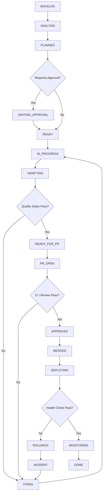

# Skill - Autonomous Software Delivery Workflow

## 1. Propósito

Definir un flujo reutilizable y verificable para llevar cualquier tarea de software desde el requerimiento inicial hasta un estado operativo en producción, con trazabilidad, validaciones automáticas, control de cambios, recuperación ante fallos y documentación.

La skill se basa en el flujo original del proyecto: recepción → investigación → plan → rama → implementación → build/tests → GitHub → diagnóstico → fix. Se amplía para incorporar estados explícitos, quality gates, CI/CD, staging, health checks, rollback y evidencia de ejecución.

## 2. Reglas no negociables

1. No asumir rutas, comandos, tecnologías ni arquitectura sin inspeccionarlos.
2. No modificar `main` directamente salvo una política explícita del repositorio.
3. No declarar éxito sin evidencia de ejecución.
4. No ocultar errores con `try/catch` vacíos, `null` ficticios, tests desactivados o warnings ignorados deliberadamente.
5. No hacer auto-merge si los quality gates requeridos no están verdes.
6. Ante un fallo, diagnosticar causa raíz antes de aplicar un parche.
7. Toda corrección de bug debe agregar o reforzar una prueba de regresión cuando sea técnicamente viable.
8. Toda tarea debe dejar trazabilidad: requerimiento, plan, cambios, pruebas y resultado.
9. Los comandos de este documento son plantillas; primero detectar el stack real.
10. Nunca almacenar secretos en manifests, commits, logs o documentación.

## 3. Máquina de estados



## 4. Task intake

Recibir un identificador estable (`TASK-ID`, Jira key, issue number, etc.) y convertir el pedido en un manifest.

Crear:

- `docs/workflow/tasks/<TASK-ID>.yml`
- `docs/workflow/specs/<TASK-ID>.md`
- `docs/workflow/plans/<TASK-ID>.md`
- `docs/workflow/tests/<TASK-ID>.md`

No implementar antes de completar el análisis mínimo necesario.

## 5. Repository discovery

Antes de tocar código, inspeccionar:

- estructura del repositorio;
- package managers y lockfiles;
- runtime y versiones;
- build/test/lint/typecheck scripts;
- configuración de CI/CD;
- variables de entorno y configuración sin exponer secretos;
- convenciones de ramas y commits;
- documentación existente;
- arquitectura y módulos afectados;
- dependencias relacionadas.

Registrar incertidumbres. No inventar archivos, rutas o comandos.

## 6. Specification

La especificación debe responder:

- qué problema se resuelve;
- qué queda dentro y fuera de alcance;
- criterios de aceptación;
- restricciones;
- riesgos;
- impacto funcional/técnico;
- dependencias.

## 7. Implementation Plan

El plan debe enumerar archivos y cambios con `[MODIFY]`, `[NEW]`, `[DELETE]`, además de estrategia UX/backend, migraciones, seguridad y pruebas.

Cada cambio debe vincularse a un criterio de aceptación o riesgo mitigado.

## 8. Task Manifest

El manifest es la fuente operativa de la tarea. Ver `templates/task-manifest.yml`.

Debe contener como mínimo:

```yaml
id: TASK-ID
type: feature
status: PLANNED
priority: medium
base_branch: main
requires_approval: false
quality_gates:
  build: true
  unit_tests: true
  integration_tests: false
  e2e: false
  lint: true
  typecheck: false
  security: true
```

## 9. Branch strategy

Convenciones recomendadas:

```text
feat/<task-id>-<slug>
fix/<task-id>-<slug>
hotfix/<incident-id>-<slug>
refactor/<task-id>-<slug>
security/<task-id>-<slug>
test/<task-id>-<slug>
docs/<task-id>-<slug>
chore/<task-id>-<slug>
```

Actualizar la rama base antes de iniciar la implementación cuando la política del repositorio lo permita.

## 10. Implementation

Implementar solamente lo definido en la especificación/plan, evitando refactors no relacionados salvo que sean necesarios para cumplir el objetivo.

Principios:

- código claro y mantenible;
- manejo explícito de errores;
- validación de entradas;
- mínimo privilegio;
- accesibilidad y responsive cuando aplique;
- no introducir dependencias innecesarias;
- comentarios sólo cuando aporten contexto que el código no expresa claramente.

Nota: el documento original indicaba comentarios en español. Esta versión conserva la intención pedagógica, pero prioriza comentarios útiles sobre comentar mecánicamente cada línea.

## 11. Validation gates

Detectar el stack real y ejecutar sólo los comandos que existan.

Orden recomendado:

```text
Install/Prepare
  ↓
Lint
  ↓
Typecheck
  ↓
Unit Tests
  ↓
Integration Tests
  ↓
Build
  ↓
E2E / Smoke Tests
  ↓
Security Checks
```

Ejemplos de placeholders:

```bash
<PROJECT_INSTALL>
<PROJECT_LINT>
<PROJECT_TYPECHECK>
<PROJECT_TEST>
<PROJECT_INTEGRATION_TEST>
<PROJECT_BUILD>
<PROJECT_E2E>
<PROJECT_SECURITY_SCAN>
```

Nunca ejecutar un comando inventado sólo porque aparece en una plantilla.

## 12. Pull Request automation

Después de validar localmente:

```bash
git status --short
git diff --check
git add .
git commit -m "<type>(<scope>): <description>"
git push -u origin <branch>
gh pr create --fill
```

El PR debe incluir objetivo, alcance, pruebas realizadas, riesgos, migraciones y cualquier cambio operativo.

## 13. CI quality gate

El merge debe depender de checks requeridos, no de la secuencia manual de comandos.

Ejemplo conceptual:

```text
PR
 ↓
CI
 ├─ lint
 ├─ typecheck
 ├─ unit
 ├─ integration
 ├─ build
 └─ security
 ↓
Required Checks PASS
 ↓
Review Policy PASS
 ↓
Auto-merge (si está habilitado)
```

## 14. Staging y producción

Preferir:

```text
Merged
 ↓
Deploy Staging
 ↓
Smoke Tests
 ↓
Approval / Policy
 ↓
Deploy Production
 ↓
Health Check
 ↓
Monitor
```

Nunca asumir que un deploy exitoso implica una aplicación saludable.

## 15. Rollback

Toda ruta de producción debe tener una estrategia de rollback conocida.

Ante un health check fallido:

1. marcar deployment como fallido;
2. preservar logs y metadatos;
3. ejecutar rollback o procedimiento equivalente;
4. verificar recuperación;
5. crear incidente;
6. abrir/derivar una tarea `fix` o `hotfix`;
7. agregar regresión y revalidar.

## 16. Error / Fix Flow

```text
ERROR
 ↓
CAPTURE
 ↓
CLASSIFY
 ↓
REPRODUCE
 ↓
ROOT CAUSE
 ↓
FIX
 ↓
REGRESSION TEST
 ↓
VERIFY
 ↓
DOCUMENT
```

Categorías mínimas:

`BUILD`, `TEST`, `RUNTIME`, `DATABASE`, `NETWORK`, `SECURITY`, `DEPLOYMENT`, `CONFIGURATION`, `DEPENDENCY`, `INFRASTRUCTURE`.

## 17. Definition of Done

Una tarea sólo puede pasar a `DONE` si cumple todos los gates obligatorios del manifest y la definición del proyecto.

Ver `templates/definition-of-done.md`.

## 18. Evidence / Execution Report

Cada ejecución debe registrar al menos:

- TASK-ID;
- execution id;
- estado final;
- branch;
- commit;
- checks ejecutados;
- resultados;
- deployment/environment;
- errores;
- rollback, si existió;
- timestamps y duración cuando estén disponibles.

Ver `templates/execution-report.md`.

## 19. Security

Nunca copiar secretos a logs, PRs o manifests.

Aplicar cuando corresponda:

- dependency audit;
- SAST;
- secret scanning;
- dependency/license policy;
- DAST o smoke security checks;
- revisión de permisos e infraestructura.

No marcar un security gate como PASS sin evidencia.

## 20. Documentación automática

Cuando sea aplicable, producir o actualizar:

- changelog/release notes;
- execution report;
- test report;
- incident report;
- documentación de migraciones;
- notas operativas.

## 21. Idempotencia y reintentos

Toda automatización debe definir qué ocurre si se ejecuta dos veces.

No duplicar:

- migraciones;
- deploys no deseados;
- PRs;
- issues;
- datos de fixtures;
- tareas programadas.

Usar IDs estables y detectar ejecuciones anteriores cuando sea posible.

## 22. Regla final

`DONE` significa evidencia de que la tarea satisface sus criterios, pasó sus quality gates requeridos, quedó integrada y, cuando aplica, fue desplegada y verificada.

No significa simplemente que el código fue escrito.
