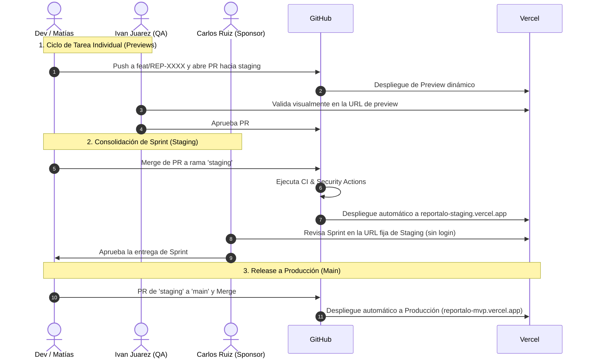

# Guía de Configuración de Ambiente Staging en Vercel (Plan Free)

Esta guía explica los pasos para asignar una **URL fija y permanente de Staging** en el panel de Vercel para que el Sponsor (**Carlos Ruiz**) y el PM (**Leonel Nuñez**) tengan acceso continuo a las versiones estables de cada Sprint.

---

## 1. Paso a Paso en Vercel Dashboard (Solo se hace 1 vez)

1. Ingresa a tu panel de Vercel: [vercel.com/dashboard](https://vercel.com/dashboard).
2. Selecciona tu proyecto **`reportalo-mvp`**.
3. Ve a **Settings** → **Domains** (en el menú lateral izquierdo).
4. En el campo de texto de dominio, ingresa un subdominio dedicado, por ejemplo:
   `reportalo-staging.vercel.app` (o `staging-reportalo-mvp.vercel.app`).
5. Haz clic en **"Add"**.
6. En la tarjeta del dominio recién creado, haz clic en **"Edit"**:
   - **Git Branch**: Selecciona o escribe **`staging`**.
   - Haz clic en **"Save"**.

¡Listo! A partir de este momento:
* `reportalo-mvp.vercel.app` apuntará siempre a la rama **`main`** (Producción).
* `reportalo-staging.vercel.app` apuntará siempre a la rama **`staging`** (Sponsor Review).

---

## 2. Flujo de Trabajo y Promoción entre Entornos

---

## 3. Beneficios para el Sponsor y el Equipo
* **URL Fija**: Carlos Ruiz puede guardar el enlace en sus favoritos y siempre verá la versión estable más reciente.
* **Aislamiento**: Los experimentos y cambios en curso en ramas de feature nunca rompen el entorno de Staging.
* **Cero Costo**: Funciona de forma 100% nativa en el plan Hobby (Free) de Vercel.
