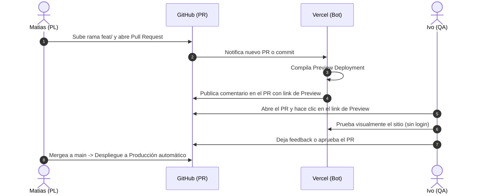

# Guía de Configuración y Operación de Vercel Previews (Plan Free)

Esta guía documenta los pasos para vincular el repositorio en Vercel y el flujo de trabajo entre **Matias (PL / Dev)** e **Ivo (QA)**.

---

## 1. Vinculación Inicial del Repositorio en Vercel (Solo se hace 1 vez)

Como manejas el proyecto en el plan Free (Hobby) de Vercel:

1. Ingresa a tu panel de Vercel: [vercel.com/dashboard](https://vercel.com/dashboard).
2. Haz clic en el botón **"Add New..."** → **"Project"** (o ve directo a [vercel.com/new](https://vercel.com/new)).
3. En la sección **"Import Git Repository"**, busca `reportalo.mvp` o `Mathiiuk/reportalo.mvp` y haz clic en **"Import"**.
4. En la pantalla de configuración del proyecto:
   - **Project Name**: `reportalo-mvp` (o el nombre que prefieras).
   - **Framework Preset**: `Other` (se detectará automáticamente cuando incorpores el framework final).
   - **Root Directory**: `./` (raíz).
5. Haz clic en **"Deploy"**.

¡Listo! A partir de este momento, GitHub y Vercel quedan sincronizados.

---

## 2. Flujo de Trabajo para Previews por Rama

---

## 3. Configuración de Acceso para QA (Ivo)

* **¿Ivo necesita cuenta en Vercel?**: **NO.** En el plan Hobby de Vercel, los enlaces de Preview generados son públicos por defecto.
* **¿Dónde encuentra Ivo el link?**: Directamente en el Pull Request de GitHub. El bot oficial de Vercel comentará en el PR:
  > *Deploys:* `https://reportalo-mvp-git-feat-...-mathiiuk.vercel.app`
* **¿Qué pasa si Matias sube nuevos commits a la rama?**: Vercel recompila automáticamente y actualiza la misma URL de preview.
