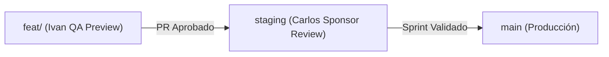

# Plan de Implementación — REP-3307: Configurar Ambiente Staging

## 1. Resumen

Configurar la infraestructura de entrega para habilitar el entorno de **Staging** permanente en Vercel, ajustando los pipelines de CI/CD para ejecutar quality gates en la rama `staging` y documentando el procedimiento de promoción para el Sponsor (**Carlos Ruiz**) y el PM (**Leonel Nuñez**).

## 2. Componentes y Archivos Afectados

### Modificados / Creados
- `[NEW]` `docs/workflow/tasks/REP-3307.yml`: Manifest operativo de la tarea.
- `[NEW]` `docs/workflow/specs/REP-3307.md`: Especificación funcional y técnica.
- `[NEW]` `docs/workflow/plans/REP-3307.md`: Este plan de implementación.
- `[NEW]` `docs/workflow/tests/REP-3307.md`: Casos de prueba para validación de Staging.
- `[NEW]` `docs/workflow/guides/staging-setup-guide.md`: Guía paso a paso de configuración en Vercel.
- `[MODIFY]` `.github/workflows/ci.yml`: Soporte para rama `staging`.
- `[MODIFY]` `.github/workflows/security.yml`: Soporte para rama `staging`.
- `[MODIFY]` `wiki/05-ci-cd-infraestructura.md`: Actualización del mapa de entornos.
- `[MODIFY]` `resume.md`: Bitácora histórica del proyecto.

## 3. Estrategia de Implementación

1. **Ramas**: Crear `staging` y `feat/REP-3307-configurar-staging`.
2. **CI/CD**: Configurar `push: branches: [main, staging]` en `ci.yml` y `security.yml`.
3. **Documentación**: Crear la guía de vinculación de dominio en Vercel Settings → Domains.
4. **Validaciones**: Verificar sintaxis YAML y reglas de negocio.
5. **Wiki**: Reflejar los 3 ambientes en la documentación viva.

## 4. Estrategia de Rollback

Si una versión desplegada en `staging` presenta fallos durante la revisión del Sponsor:
1. Revertir el commit defectuoso en la rama `staging`.
2. O usar **Instant Rollback** desde el dashboard de Vercel seleccionando el deployment previo exitoso en `staging`.
