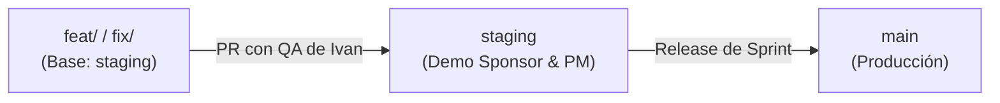

# Guía de Contribución y Gobernanza — Reportalo MVP

¡Bienvenido al repositorio de desarrollo de **Reportalo (RAR-2026)**! Para garantizar la calidad, seguridad y estabilidad de las entregas, todo el equipo y agentes colaboradores deben seguir estas normas.

---

## 1. Estrategia de Ramas y Promoción

Operamos con un modelo de tres entornos: **Preview**, **Staging** y **Producción**.



### Convención de Nombres de Ramas
* `feat/<JIRA-ID>-<slug>`: Nuevas funcionalidades (ej. `feat/REP-3308-login-google`).
* `fix/<JIRA-ID>-<slug>`: Corrección de errores (ej. `fix/REP-3310-error-gps`).
* `hotfix/<INCIDENT-ID>-<slug>`: Corrección urgente directo a `main` y `staging`.
* `chore/<JIRA-ID>-<slug>`: Mantenimiento, dependencias o configuración.

---

## 2. Convención de Commits (en Español)

Todos los commits deben redactarse en **español** siguiendo el estándar *Conventional Commits*:

```text
<tipo>(<módulo>): <descripción concisa en minúsculas>

- Detalle de los cambios realizados
- Referencia al ticket de Jira (ej. REP-XXXX)
```

**Tipos válidos**:
* `feat`: Nueva funcionalidad.
* `fix`: Corrección de bug.
* `docs`: Documentación o cambios en la wiki.
* `infra`: Configuración de Vercel, GitHub Actions o DevOps.
* `test`: Creación o mejora de casos de prueba.
* `refactor`: Reestructuración de código sin cambio de comportamiento.

---

## 3. Flujo del Día a Día para Desarrolladores

1. **Crear la rama desde `staging` actualizada**:
   ```bash
   git checkout staging
   git pull origin staging
   git checkout -b feat/REP-XXXX-nombre-tarea
   ```
2. **Crear el manifest de la tarea en `docs/workflow/tasks/REP-XXXX.yml`**.
3. **Desarrollar y validar localmente** (`lint`, `typecheck`, `test`, `build`).
4. **Subir la rama y abrir el Pull Request apuntando a `staging`**:
   ```bash
   git push -u origin feat/REP-XXXX-nombre-tarea
   ```
5. **Completar la plantilla del PR**: Incluir enlace al ticket de Jira y checklist.
6. **Validación de QA**: **Ivan Juarez (QA)** revisará el Preview desplegado por Vercel.
7. **Merge a `staging`**: Realizado por **Matías Krepchuk (Líder Técnico)** tras aprobación de QA.

---

## 4. Paso a Producción (`main`)

* Solo **Matías Krepchuk (Líder Técnico)** tiene permisos para hacer merge a `main`.
* Los merges a `main` se realizan al cierre de cada Sprint tras la aprobación formal de **Carlos Ruiz (Sponsor)** y **Leonel Nuñez (PM)** en el entorno de Staging.

---

## 5. Reglas No Negociables
1. ❌ **No direct-push a `main` ni a `staging`**.
2. 🔒 **Nunca subir secretos ni credenciales** (usar GitHub Secrets y Vercel Env Variables).
3. 📝 **Toda tarea debe registrarse en la bitácora `resume.md`**.
