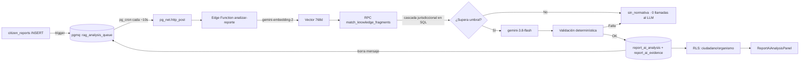

# 📑 Informe Técnico: RAG Jurídico Productivo
## De REP-2907 (spike) al motor real — Sprint 12, sesión 2026-09-14

- **Épica:** [REP-1009: IA jurídica / RAG](https://unlz2026.atlassian.net/browse/REP-1009)
- **Tickets que este trabajo cubre (verificado contra Jira real):** [REP-2908](https://unlz2026.atlassian.net/browse/REP-2908) · [REP-2909](https://unlz2026.atlassian.net/browse/REP-2909) · [REP-3772](https://unlz2026.atlassian.net/browse/REP-3772) · partes de [REP-3775](https://unlz2026.atlassian.net/browse/REP-3775) y [REP-3776](https://unlz2026.atlassian.net/browse/REP-3776)/[REP-3777](https://unlz2026.atlassian.net/browse/REP-3777) (código escrito, no aplicado — ver §3)
- **Autor:** Matías Krepchuk (con asistencia de Claude Code)
- **Rama de trabajo:** `feat/REP-2908-rag-juridico-de-produccion-...` y `feat/REP-2909-cerrar-rag-productivo-...` (commiteadas localmente, sin push)
- **Estado:** Código completo y probado (170 tests, build limpio). **Nada ejecutado contra Supabase real.**

> **Nota importante sobre numeración:** durante la sesión se usó "REP-2909" como nombre de rama antes de tener acceso a Jira, para agrupar 4 bloques (pipeline asíncrono, persistencia, RLS, pantalla del ciudadano). Al conectar Jira se confirmó que el ticket real **REP-2909 es "Guardar clasificación jurídica"** — más angosto que el nombre de la rama. La tabla del §3 hace la corrección: cada bloque de código mapea a su ticket real.

---

## 1. Qué se hizo — resumen ejecutivo

El RAG jurídico de Reportalo dejó de ser una simulación (REP-2907: corpus hardcodeado en JS + "embedding" hecho con matching de palabras) y pasó a ser un pipeline real:

1. **Recuperación real**: embeddings de `gemini-embedding-2` (768 dimensiones), cascada jurisdiccional resuelta en SQL (`match_knowledge_fragments`), nunca por texto en JS.
2. **Generación real**: `gemini-3.8-flash` redacta el fundamento citando solo lo recuperado, con esquema JSON obligatorio.
3. **Anti-alucinación real**: validación determinística que verifica que cada cita exista literal en el fragmento recuperado — si algo no cierra, cae a `indeterminado`, nunca inventa.
4. **Validado con datos reales**, no solo mockeados: se corrieron los 6 casos oficiales de REP-3764 contra un Postgres local (con el corpus real de 15 fragmentos) y contra la API real de Gemini. 4 de 6 casos completaron generación real con resultados correctos; los otros 2 recuperaron los fragmentos correctos pero la generación chocó con la cuota gratuita de Gemini (ver §5).
5. Se escribió (sin ejecutar) todo lo que falta para que esto deje de ser solo un motor de banco de pruebas: el disparo automático, el guardado del resultado, los permisos de lectura y un componente de pantalla para el ciudadano.

---

## 2. Arquitectura implementada

---

## 3. Mapeo contra Jira real (verificado 2026-09-14)

| Bloque de código | Archivo(s) | Ticket real | Estado del ticket antes | Qué falta para cerrarlo |
|---|---|---|---|---|
| Recuperación + cascada + RPC | `legalRagService.js`, `rag_knowledge_schema.sql` | [REP-2907](https://unlz2026.atlassian.net/browse/REP-2907) (spike, ya Finalizada) → reemplazado | Finalizada | — (este trabajo lo reemplaza, no lo reabre) |
| Prompt + generación + esquema JSON | `geminiClient.js`, `analizar-reporte/index.ts` | [REP-2908 "Crear prompt controlado con salida JSON"](https://unlz2026.atlassian.net/browse/REP-2908) | Por hacer | Ejecutar contra Gemini real con cuota paga (§5) y correr los 6-8 casos que pide el ticket con evidencia completa |
| Validación anti-alucinación | `validateGeneratedAnalysis`/`validateLlmAnalysis` | [REP-3772 "Validar determinísticamente la salida del RAG"](https://unlz2026.atlassian.net/browse/REP-3772) | Por hacer | Código ya cumple los criterios del ticket; falta correrlo con casos reservados (REP-2910) |
| Persistencia de la clasificación | `reportAiAnalysisPersistence.js`, `report_ai_analysis` | [REP-2909 "Guardar clasificación jurídica"](https://unlz2026.atlassian.net/browse/REP-2909) | Por hacer | Aplicar contra Supabase real; confirmar columnas exactas de `report_ai_analysis` (ver §4, punto 2) |
| Persistencia de evidencia/auditoría | `report_ai_evidence`, tokens/modelo | [REP-3777 "Persistir evidencia y auditoría del análisis RAG"](https://unlz2026.atlassian.net/browse/REP-3777) | Por hacer (depende de 3775 y 3776) | Igual que arriba, más desplegar el pipeline asíncrono primero (es dependencia declarada en el propio ticket) |
| RLS / seguridad | `rag_rls_policies.sql` | [REP-3775 "Implementar seguridad y aislamiento del RAG"](https://unlz2026.atlassian.net/browse/REP-3775) | Por hacer | Aplicar contra Supabase real + evidencia de pruebas de acceso permitido/denegado (el ticket lo exige explícitamente) |
| Pipeline asíncrono | `rag_async_pipeline.sql` | [REP-3776 "Implementar orquestación asíncrona del análisis RAG"](https://unlz2026.atlassian.net/browse/REP-3776) | Por hacer | Aplicar contra Supabase real; confirmar que `pgmq`/`pg_cron`/`pg_net` estén habilitados en el proyecto |
| Pantalla del ciudadano | `ReportAiAnalysisPanel.jsx`, `reportAiAnalysisService.js` | **No hay ticket** — el más cercano es [REP-2902 "Enviar fundamento legal preliminar"](https://unlz2026.atlassian.net/browse/REP-2902), pero es *"como organismo quiero recibir..."*, no la vista del ciudadano | — | Falta crear el ticket, o ampliar el alcance de una historia existente (ver §4, punto 3) |
| Decisiones de arquitectura (R-2 a R-5) | — (no es código) | [REP-3773 "Cerrar decisiones técnicas pendientes del RAG"](https://unlz2026.atlassian.net/browse/REP-3773) | Por hacer | **Bloquea 3774, 3775 y 3776 según sus propias dependencias declaradas en Jira** — ver §4, punto 1 |
| Productivizar el corpus | — (no ejecutado) | [REP-3774 "Productivizar ingesta y versionado del corpus RAG"](https://unlz2026.atlassian.net/browse/REP-3774) | Por hacer (depende de 3773) | Correr `docs/REP-3769_seed_y_RAG.sql` contra Supabase real |

**Dependencias declaradas en Jira (no inventadas, están en las descripciones de los tickets):**
`REP-3773` → `REP-3774` → `REP-3775` → `REP-3776` → `REP-3777`. Este orden es el que se usa en el §4.

---

## 4. Cómo seguir con los puntos 1, 2 y 3

### Punto 1 — Ejecutar contra Supabase real

No lo puedo hacer yo (sin Supabase CLI ni credenciales de servicio en este entorno). El orden que impone el propio Jira:

1. **[REP-3773](https://unlz2026.atlassian.net/browse/REP-3773) primero, siempre.** Son 4 decisiones chicas, ninguna es código:
   - **R-2:** ¿CABA adhirió a la Ley 24.449? Buscar la fuente oficial y registrar la respuesta (aunque sea "no hay evidencia").
   - **R-3:** Confirmar por escrito el ADR: `gemini-embedding-2` a 768 dimensiones + versión exacta de `gemini-3.8-flash` (ya está implementado así en el código; falta el registro formal).
   - **R-4:** Umbral de similitud y `match_count`. **Tengo un dato real para vos**: con embeddings reales de Gemini, el Caso F (comercio irregular) recuperó fragmentos no relacionados con similitud 0.55-0.64 — el umbral provisorio de 0.45 quedó corto. Recomiendo no bajar de ~0.55-0.60 hasta que REP-2910 lo mida con más casos.
   - **R-5:** Si la categoría que elige el ciudadano filtra la búsqueda o solo se le pasa al LLM. El código que escribí ya sigue la recomendación del docx (se pasa sin filtrar) — falta que quede como decisión formal del ticket.
2. **[REP-3774](https://unlz2026.atlassian.net/browse/REP-3774):** correr `docs/REP-3769_seed_y_RAG.sql` completo (PARTES 0-8) contra el Supabase real, siguiendo `docs/REP-3769_guia_ejecucion_seeds_y_RAG.md`. Esto carga el esquema `knowledge_*` y el corpus real de 15 fragmentos. Yo ya probé ese mismo esquema en un Postgres local (ver `supabase/local-dev/`) — el SQL en sí está validado, lo que falta es correrlo donde importa.

### Punto 2 — Desplegar

1. **[REP-3775](https://unlz2026.atlassian.net/browse/REP-3775):** aplicar `supabase/rag_rls_policies.sql`. El ticket pide evidencia explícita de accesos permitidos y denegados — la tabla del §3 de `.agents/workflow/executions/REP-2909-run-001.md` te da el punto de partida (está hecha por lectura del SQL, no ejecutada).
2. **[REP-3776](https://unlz2026.atlassian.net/browse/REP-3776):** aplicar `supabase/rag_async_pipeline.sql`. Antes de correrlo:
   - Habilitar `pgmq`, `pg_cron`, `pg_net` en el proyecto (Dashboard → Database → Extensions).
   - Crear en Supabase Vault los secrets `rag_analizar_reporte_url` y `rag_service_role_key` (nombres exactos que usa el SQL).
3. Desplegar la función: `supabase functions deploy analizar-reporte`, con el secret `GEMINI_API_KEY` — **con un plan pago**, no el gratuito. La clave que probamos hoy se agotó a las 20 llamadas de generación (`generate_content_free_tier_requests`, límite diario).
4. **[REP-3777](https://unlz2026.atlassian.net/browse/REP-3777):** con lo anterior desplegado, el bloque de persistencia ya escrito en `analizar-reporte/index.ts` empieza a guardar solo. Confirmar contra la tabla real que los nombres de columna que asumí (`report_id`, `result_status_code`, `is_infraction`, `citizen_feedback`, `official_legal_foundation`, `confidence_score`, `suggested_agency_id`, documentados en `src/services/reportAiAnalysisPersistence.js`) coinciden — no tuve forma de inspeccionar esa tabla real desde esta sesión.

### Punto 3 — Pantalla del ciudadano

**No hay ticket para esto todavía.** El componente (`ReportAiAnalysisPanel.jsx`) y el service de lectura (`reportAiAnalysisService.js`) están listos y probados (8 tests), pero no hay dónde conectarlos: `src/pages/ReportsPage.jsx` es 100% mock (`demoReports` hardcodeado), sin fetching real ni ruta de detalle — el botón "Ver detalle →" no navega a ningún lado.

Dos caminos:
- **Crear un ticket nuevo** ("Ver detalle de reporte con fundamento legal" o similar), hijo de REP-1009 o de la épica del ciudadano que corresponda.
- **Ampliar REP-2902** si Hernán/PO decide que la misma historia cubre organismo y ciudadano (hoy el texto dice *"como organismo quiero recibir..."*, no ciudadano — es una decisión de producto, no mía).

Cuando exista esa pantalla, conectar es directo: `fetchReportAiAnalysis(supabaseClient, reportId)` trae el dato, `<ReportAiAnalysisPanel analysis={...} />` lo muestra.

---

## 5. Hallazgo relevante para R-4 (calibración) y para presupuesto

Al correr los 6 casos con Gemini real (`gemini-3.8-flash`), la clave que usamos es de **plan gratuito**: límite de **20 llamadas/día** a `generate_content` para ese modelo, ya agotado durante la sesión. El embedding (`gemini-embedding-2`) tiene cuota aparte y no se vio afectado. Para cualquier prueba real futura con volumen (o producción) hace falta una clave de **plan pago** — el propio docx ya lo advertía (*"el plan gratuito no sirve para reportes reales"*).

---

## 6. Qué está commiteado (sin push, en tu máquina)

- Rama `feat/REP-2908-rag-juridico-de-produccion-...`: servicio RAG completo, cliente Gemini, esquema SQL, Edge Function, tests (24), corpus verbatim.
- Rama `feat/REP-2909-cerrar-rag-productivo-...`: pipeline asíncrono, persistencia, RLS, panel del ciudadano, tests (14 más).
- `supabase/local-dev/`: Postgres local de desarrollo (sin pgvector, Docker no funcionó en esta máquina — ver detalle en esa carpeta) para seguir probando sin tocar Supabase.
- Reportes de ejecución detallados: `.agents/workflow/executions/REP-2908-run-001.md` y `REP-2909-run-001.md`.

---

**Documentos relacionados:** [REP-1009 (docx)](../docs/REP-1009_RAG_de_punta_a_punta.docx) · [REP-3769 (script + guía)](../docs/REP-3769_seed_y_RAG.sql) · [REP-3764 (casos esperados)](../docs/REP-3764_casos_esperados.md) · Épica [REP-1009 en Jira](https://unlz2026.atlassian.net/browse/REP-1009)
