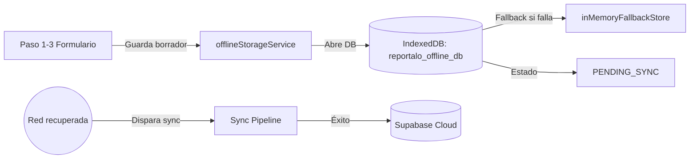
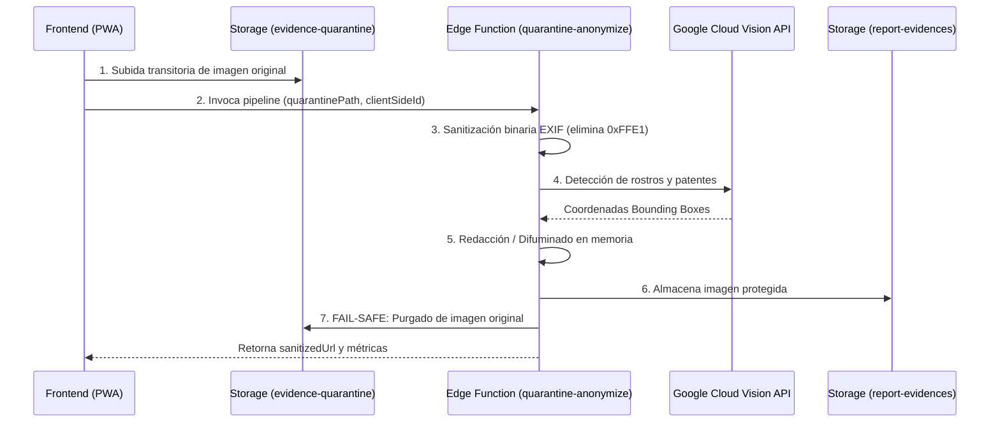
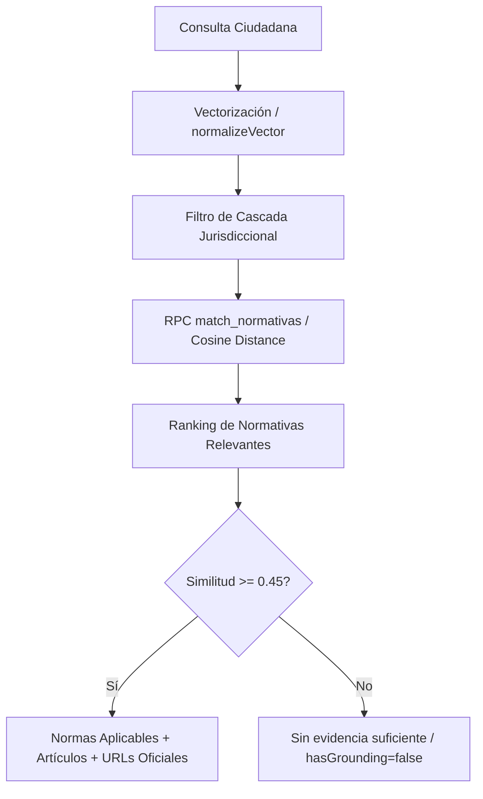

# 📘 Runbook Técnico de Handoff — Sprint 11
## Mitigación de Concentración de Conocimiento (REP-3765)

- **Ticket Jira:** [REP-3765: T | Handoff técnico de offline, privacidad y RAG — Sprint 11](https://unlz2026.atlassian.net/browse/REP-3765)
- **Autor / Ownership Técnico:** Matías Krepchuk
- **Shadows / Validadores Técnicos:** 
  - **Iván (Ivo):** Bloque 1 (Offline & Borradores) y Bloque 2 (Privacidad, Cuarentena & EXIF).
  - **Hernán:** Bloque 3 (Corpus Legal, Embeddings & RAG pgvector).
- **Fecha:** Septiembre 2026
- **Estimación:** 0 SP (Transferencia de conocimiento y mitigación de riesgo Bus Factor).

---

## 🎯 Objetivo del Documento

Reducir la dependencia de conocimiento concentrado en Matías durante el Sprint 11, proveyendo una guía técnica estructurada, concisa y directamente reproducible para que **Iván** y **Hernán** puedan:
1. Comprender la arquitectura y el flujo de datos de cada bloque.
2. Levantar, ejecutar y validar pruebas de punta a punta de forma 100% autónoma.
3. Diagnosticar y resolver los fallos más frecuentes sin requerir asistencia directa.

---

## 🧱 Bloque 1: REP-2703 — Persistencia Offline, IndexedDB y `PENDING_SYNC`

### 1. Responsabilidad y Arquitectura
Permite que un ciudadano complete reportes en zonas sin conectividad (o con conectividad intermitente). Los borradores y las fotografías binarias se guardan en el navegador dentro de **IndexedDB** bajo el estado transaccional `PENDING_SYNC`. Al restablecerse la red, se orquesta la sincronización automática hacia el backend.



### 2. Archivos y Módulos Principales
* [`src/services/offlineStorageService.js`](file:///d:/Proyectos/reportalo.mvp/src/services/offlineStorageService.js): Motor central de IndexedDB (`reportalo_offline_db`), versionado, índices por estado y fallback en memoria.
* [`src/types/evidence.js`](file:///d:/Proyectos/reportalo.mvp/src/types/evidence.js): Constantes de estado (`DRAFT_LOCAL`, `PENDING_SYNC`, `SYNCED`).
* [`src/pages/NewReportPage.jsx`](file:///d:/Proyectos/reportalo.mvp/src/pages/NewReportPage.jsx): Integración con la UI del asistente de reporte.
* [`src/test/OfflineStorageService.test.js`](file:///d:/Proyectos/reportalo.mvp/src/test/OfflineStorageService.test.js): Pruebas unitarias de persistencia.
* [`src/test/OfflineReportFlow.test.jsx`](file:///d:/Proyectos/reportalo.mvp/src/test/OfflineReportFlow.test.jsx): Pruebas de integración del flujo de usuario offline.

### 3. Dependencias y Variables de Entorno
* **Dependencias:** Ninguna librería externa pesada; utiliza la **API nativa de IndexedDB** (`window.indexedDB`) del estándar W3C con compatibilidad Web Workers.
* **Variables requeridas:** Ninguna. Funciona sin red ni credenciales de Supabase.

### 4. Cómo Probar el Flujo

#### A. Validación Automatizada (Tests)
```bash
# Ejecutar suite de pruebas unitarias e integración de offline
npx vitest run src/test/OfflineStorageService.test.js src/test/OfflineReportFlow.test.jsx
```
*Salida esperada:* **11 tests pasando (100% verde)**.

#### B. Validación Manual Interactiva (Iván / QA)
1. Iniciar la app localmente con `pnpm dev`.
2. Abrir las DevTools del navegador (F12) e ir a la pestaña **Application** -> **Storage** -> **IndexedDB** -> `reportalo_offline_db` -> `draft_reports`.
3. Simular modo avión en la pestaña **Network** (marcar *Offline*).
4. Completar un reporte con fotografía en `/report/new`.
5. Comprobar que en IndexedDB se crea un registro con clave `client_side_id`, estado `PENDING_SYNC` y la propiedad `blob` preservando los bytes crudos (sin Base64).
6. Recargar la página: el sistema restaura automáticamente el borrador activo vía `getActiveDraftReport()`.

### 5. Puntos de Diagnóstico y Fallos Frecuentes
| Síntoma | Causa Raíz | Solución Rápida |
| :--- | :--- | :--- |
| `IndexedDB no disponible` en consola | Navegador en modo incógnito estricto (Firefox/Safari) o iframe cross-origin sin permisos. | El servicio conmuta automáticamente a `inMemoryFallbackStore` (Map en RAM). Verificar que los datos sobrevivan durante la sesión activa. |
| La imagen queda corrupta al restaurar | Se guardó una URL de objeto temporal (`blob:http...`) en vez del objeto `File`/`Blob` real. | Verificar que en `saveDraftReport` la evidencia use la propiedad `blob: ev.file \|\| ev.blob`. Las URLs `blob:` expiran al recargar, pero los objetos `Blob` en IndexedDB persisten intactos. |
| El reporte se duplica al sincronizar | Discrepancia entre `client_side_id` e `id` en base de datos. | Usar siempre `client_side_id` como clave de idempotencia (`upsert` por `client_side_id`). |

### 6. Qué puede Validar Iván (Ivo) sin Matías
* [x] Derivar escenarios de prueba exploratoria (corte de red en Paso 1, Paso 2 y Paso 3).
* [x] Validar que las fotos de 5MB no bloqueen el hilo principal (se guardan como Blob binario directo).
* [x] Comprobar que la recarga accidental de página F5 en el paso de confirmación no pierda la evidencia adjuntada.

---

## 🛡️ Bloque 2: REP-2400 / 2401 / 2404 — Pipeline de Privacidad, Cuarentena Server-Side y EXIF

### 1. Responsabilidad y Arquitectura
Implementa el principio de **Privacidad por Diseño (Privacy by Design)** y protección contra exposición de datos personales:
1. **Cuarentena Privada:** La foto se sube exclusivamente al bucket privado `evidence-quarantine` (nunca al público directamente).
2. **Sanitización EXIF (REP-2401):** Remoción a nivel de bytes de cabeceras JPEG `APP1` (`0xFFE1`) que contienen coordenadas GPS del ciudadano y modelo de cámara.
3. **Anonimización Visual (REP-2400):** Detección de rostros y patentes mediante Google Cloud Vision / emulador de bounding boxes y difuminado (*blur/redact*).
4. **Destrucción Fail-Safe (REP-2404):** Si el procesamiento falla o se cancela, la imagen original en cuarentena se **destruye obligatoriamente**. Solo la imagen final anonimizada se transfiere a `report-evidences`.



### 2. Archivos y Módulos Principales
* [`src/services/quarantinePipelineService.js`](file:///d:/Proyectos/reportalo.mvp/src/services/quarantinePipelineService.js): Orquestador cliente, control fail-safe y fallback offline.
* [`src/services/metadataSanitizer.js`](file:///d:/Proyectos/reportalo.mvp/src/services/metadataSanitizer.js): Parseador binario de segmentos JPEG para auditar y remover metadatos sin decodificar el canvas.
* [`supabase/functions/quarantine-anonymize/index.ts`](file:///d:/Proyectos/reportalo.mvp/supabase/functions/quarantine-anonymize/index.ts): Edge Function Deno server-side que ejecuta la cuarentena y la anonimización.
* [`src/test/QuarantinePipelineService.test.js`](file:///d:/Proyectos/reportalo.mvp/src/test/QuarantinePipelineService.test.js): Pruebas de integración del pipeline y purgado fail-safe.
* [`src/test/MetadataProtection.test.jsx`](file:///d:/Proyectos/reportalo.mvp/src/test/MetadataProtection.test.jsx): Pruebas de detección y remoción de EXIF.

### 3. Dependencias y Variables de Entorno
* **Storage en Supabase:** Buckets `evidence-quarantine` (privado) y `report-evidences` (público).
* **Variables en la Edge Function (Supabase Secrets):**
  * `SUPABASE_URL`: URL del proyecto Supabase.
  * `SUPABASE_SERVICE_ROLE_KEY`: Clave de servicio para mover y borrar archivos entre buckets privados.
  * `GOOGLE_VISION_API_KEY` (Opcional): Clave de API de Google Cloud Vision. Si no está configurada, el pipeline activa un fallback determinístico seguro sin bloquear el flujo.

### 4. Cómo Probar el Flujo

#### A. Validación Automatizada (Tests)
```bash
# Ejecutar suite de privacidad y cuarentena
npx vitest run src/test/QuarantinePipelineService.test.js src/test/MetadataProtection.test.jsx
```
*Salida esperada:* **20 tests pasando (100% verde)**.

#### B. Validación Manual de Purgado Fail-Safe (Iván / QA)
1. Invocar `processEvidenceThroughQuarantine({ file, clientSideId, simulateError: true })`.
2. Verificar que retorna `{ success: false, failSafeTriggered: true }`.
3. Comprobar en el bucket `evidence-quarantine` de Supabase que el archivo transitorio `temp_...jpg` fue **eliminado inmediatamente** y no quedó ninguna imagen huérfana en el servidor.

### 5. Puntos de Diagnóstico y Fallos Frecuentes
| Síntoma | Causa Raíz | Solución Rápida |
| :--- | :--- | :--- |
| Error `403 Forbidden` al subir a cuarentena | Falta de política RLS de inserción en el bucket `evidence-quarantine`. | Comprobar que los usuarios anónimos o autenticados tengan permiso `INSERT` en el bucket de cuarentena. En modo DEV, el servicio conmuta automáticamente a emulación local segura. |
| La Edge Function responde `Error en procesamiento` | Falta `SUPABASE_SERVICE_ROLE_KEY` en los secrets de Supabase. | Configurar el secret con `supabase secrets set SUPABASE_SERVICE_ROLE_KEY=...`. |
| Imágenes PNG o WebP no pierden metadatos | El algoritmo de sanitización binaria rápida está optimizado para JPEG (`0xFFE1`). | Para formatos no-JPEG, la Edge Function recomprime la imagen a WebP estándar o aplica recreación de buffer para descartar metadatos residuales. |

### 6. Qué puede Validar Iván (Ivo) sin Matías
* [x] Tomar una foto con celular que contenga GPS real y verificar con `exiftool` o inspector web que la URL final no contenga ningún tag de geolocalización ni marca del dispositivo.
* [x] Simular desconexión durante el procesamiento y confirmar que el frontend muestra el cartel de protección sin colapsar.
* [x] Verificar que nunca se exponga una URL directa al bucket `evidence-quarantine`.

---

## ⚖️ Bloque 3: REP-2907 — Flujo RAG Legal: Chunking, Embeddings y pgvector

### 1. Responsabilidad y Arquitectura
Vertical slice técnico que otorga fundamentación jurídica automática a los reportes ciudadanos, distinguiendo la jurisdicción del hecho (Avellaneda / PBA vs CABA / Nación) y evitando falsos positivos mediante distancias vectoriales semánticas:
1. **Corpus REP-2906:** 7 fuentes normativas oficiales que conforman 8 fragmentos atómicos (LOM Arts. 52 y 59 desagrupados).
2. **Vectorización:** Emulador determinístico de 64 dimensiones para tests offline; arquitectura preparada para **768 dimensiones** con **Google Gemini (`text-embedding-004`)** en producción.
3. **Normalización:** Todos los vectores tienen norma euclidiana $L_2 = 1.0$. La similitud de coseno equivale directamente al producto punto ($A \cdot B$).
4. **Descarte de Distractor:** El ítem 8 (Dec-Ley 8031/73) compite en el espacio vectorial con metadatos neutros y pierde por baja similitud de coseno (< 0.40).



### 2. Archivos y Módulos Principales
* [`src/services/legalRagService.js`](file:///d:/Proyectos/reportalo.mvp/src/services/legalRagService.js): Servicio de retrieval, cálculo de similitud coseno, vectorizador léxico y suite de benchmarking.
* [`supabase/rag_normativas.sql`](file:///d:/Proyectos/reportalo.mvp/supabase/rag_normativas.sql): DDL de `normativas`, habilitación de `pgvector`, RPC `match_normativas` y seed de 8 fragmentos oficiales verificados.
* [`src/test/LegalRagService.test.js`](file:///d:/Proyectos/reportalo.mvp/src/test/LegalRagService.test.js): Pruebas unitarias completas y validación de casos esperados A a F de REP-3764 más Caso Ciego `UT-RAG-08-B`.
* [`docs/REP-2907-informe-tecnico-rag-handoff.md`](file:///d:/Proyectos/reportalo.mvp/docs/REP-2907-informe-tecnico-rag-handoff.md): Informe exhaustivo de handoff con evidencia matemática.

### 3. Dependencias y Variables de Entorno
* **Extensión PostgreSQL:** `CREATE EXTENSION IF NOT EXISTS vector;` en Supabase.
* **Columna Vectorial:** `ALTER TABLE public.normativas ALTER COLUMN embedding TYPE vector;` (admite 64d en spike y 768d con Gemini).
* **Variables:** `VITE_SUPABASE_URL` y `VITE_SUPABASE_PUBLISHABLE_KEY`.

### 4. Cómo Probar el Flujo

#### A. Validación Automatizada (Tests en 40ms)
```bash
# Correr los 12 tests del RAG legal
npx vitest run src/test/LegalRagService.test.js
```
*Salida esperada:* **12 tests pasando (100% verde)**.

#### B. Ejecución de los Casos de Hernán (REP-3764)
El servicio exporta la función `benchmarkRagQueries()`. Desde Node o consola de navegador se puede ejecutar:
```javascript
import { benchmarkRagQueries } from './src/services/legalRagService.js';
const report = await benchmarkRagQueries();
console.log(report.status); // "GO"
console.log(report.accuracyPercent); // 100%
console.log(report.averageLatencyMs); // ~0.5ms en local
```

#### C. Validación en Supabase (Hernán)
1. Abrir el SQL Editor en Supabase.
2. Ejecutar [`supabase/rag_normativas.sql`](file:///d:/Proyectos/reportalo.mvp/supabase/rag_normativas.sql).
3. Probar la función RPC:
```sql
-- Consulta de prueba con vector de 64 dimensiones (ejemplo Caso A)
SELECT norma_codigo, titulo, articulo, similarity, fuente_url 
FROM public.match_normativas(
  query_embedding := '[0.2748,0.2748,0.2748,0.2748,0.2748,0.2748,0.2748,0.2748,0,0,0,0,0,0,0,0,0,0,0,0,0,0,0,0,0.1374,0.1374,0.1374,0.1374,0.1374,0.1374,0.1374,0.1374,0,0,0,0,0,0,0,0,0,0,0,0,0,0,0,0,0.1099,0.1099,0.0549,0.1648,0.0549,0,0,0,0.1099,0.1648,0.2198,0,0.2198,0.1648,0.1099,0.1099]'::vector,
  match_threshold := 0.40,
  match_count := 3,
  filter_jurisdiccion := 'Provincial — Buenos Aires'
);
```

### 5. Puntos de Diagnóstico y Fallos Frecuentes
| Síntoma | Causa Raíz | Solución Rápida |
| :--- | :--- | :--- |
| `column "tipo_fundamento" does not exist` en Supabase | La base en la nube no corrió la migración de REP-2907. | Ejecutar el script `supabase/rag_normativas.sql` en el SQL Editor de Supabase. |
| `violates not-null constraint "categoria"` | El distractor usa `categoria: NULL` pero la columna tenía `NOT NULL`. | Ejecutar `ALTER TABLE public.normativas ALTER COLUMN categoria DROP NOT NULL;`. |
| El distractor (Dec-Ley 8031/73) aparece en Caso E | Similitud accidental por palabras de orden público. | Verificado en Sprint 11: Ley 24.449 obtiene **0.9942** y el distractor obtiene **0.1178**, quedando descartado por umbral (0.45). |

### 6. Qué puede Validar Hernán sin Matías
* [x] Auditar la tabla `normativas` para verificar que las 8 fuentes posean URLs oficiales que responden HTTP 200 (Infoleg, Normas GBA, Boletín Oficial CABA, Jusbaires).
* [x] Evaluar la asimetría jurisdiccional en Caso D: alumbrado en Avellaneda devuelve LOM 52 y en CABA devuelve Ley 210.
* [x] Incorporar nuevos artículos o fragmentos normativos agregando filas a la tabla SQL sin necesidad de alterar el código del servicio.

---

## 📊 Matriz de Validación Autónoma (Shadowing)

| Bloque Técnico | Responsable Primario | Validador Shadow | Comando / Herramienta de Validación | Artifact / Evidencia |
| :--- | :--- | :--- | :--- | :--- |
| **REP-2703 (Offline / IndexedDB)** | Matías Krepchuk | **Iván (Ivo)** | `npx vitest run src/test/OfflineStorageService.test.js` | `reportalo_offline_db` en DevTools |
| **REP-2400/2404 (Privacidad / Cuarentena)** | Matías Krepchuk | **Iván (Ivo)** | `npx vitest run src/test/QuarantinePipelineService.test.js` | Bucket `evidence-quarantine` purgado |
| **REP-2907 (RAG Normativo / pgvector)** | Matías Krepchuk | **Hernán** | `npx vitest run src/test/LegalRagService.test.js` | [docs/REP-2907-informe-tecnico-rag-handoff.md](file:///d:/Proyectos/reportalo.mvp/docs/REP-2907-informe-tecnico-rag-handoff.md) |

---

## ⚡ Cheat Sheet: Comandos de 30 Segundos

```bash
# 1. Validar la suite completa del sprint (25 archivos / 144 tests en verde):
npx vitest run

# 2. Validar únicamente los tres bloques del handoff:
npx vitest run src/test/OfflineStorageService.test.js src/test/QuarantinePipelineService.test.js src/test/LegalRagService.test.js

# 3. Validar compilación de producción:
pnpm run build
```

---

> [!TIP]
> **Para Iván y Hernán:** Este runbook es autosuficiente. Si encuentran cualquier duda en la ejecución de sus bloques respectivos, pueden revisar directamente el archivo [`docs/REP-3765-runbook-handoff-sprint11.md`](file:///d:/Proyectos/reportalo.mvp/docs/REP-3765-runbook-handoff-sprint11.md) o ejecutar los comandos de Vitest correspondientes.
