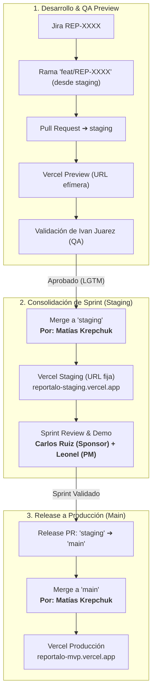

# Manual de Estrategia de Ramas y Promoción (Git Workflow)

Este documento detalla el procedimiento operativo para la creación, desarrollo, validación y promoción de ramas en el repositorio **`Mathiiuk/reportalo.mvp`** ([`CONTRIBUTING.md:1-50`](https://github.com/Mathiiuk/reportalo.mvp/blob/main/CONTRIBUTING.md#L1-L50)).

---

## 1. Topología del Ciclo de Vida



---

## 2. Responsabilidades por Rol

| Integrante | Rol | Acción en Git |
| :--- | :--- | :--- |
| **Matías Krepchuk** | **Líder Técnico** | Revisa código, hace merge a `staging` y es el **único autorizado** para mergear a `main`. |
| **Ivan Juarez** | **QA y UX/UI** | Prueba los Previews generados por Vercel y aprueba los PRs hacia `staging`. |
| **Leonel Nuñez** | **Project Manager (PM)** | Coordina los tickets de Jira y planifica los hitos de Release de cada Sprint. |
| **Hernán Gregorini** | **Product Owner (PO)** | Valida que los entregables satisfagan los requerimientos del usuario y organismos. |
| **Carlos Ruiz** | **Sponsor y Auditor** | Evalúa las versiones congeladas en `reportalo-staging.vercel.app` para dar el visto bueno de pase a producción. |

---

## 3. Comandos Rápidos de Referencia

### Iniciar una nueva tarea:
```bash
git checkout staging
git pull origin staging
git checkout -b feat/REP-XXXX-slug
```

### Enviar cambios para revisión:
```bash
git add .
git commit -m "feat(modulo): descripcion clara en espanol (REP-XXXX)"
git push -u origin feat/REP-XXXX-slug
```

### Abrir Pull Request:
* Base: `staging`
* Compare: `feat/REP-XXXX-slug`
* Asignar revisor: Ivan Juarez (`QA`) y Matías Krepchuk (`Tech Lead`).
