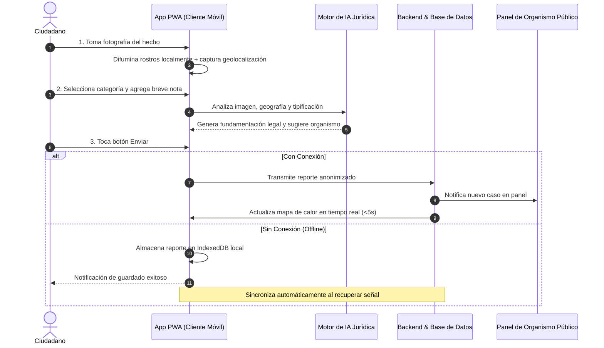
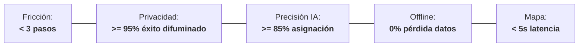

# 📜 Acta de Inicio — Reportalo v3.0

Este documento representa el marco estratégico y funcional del proyecto **Reportalo — Plataforma de Auditoría Ciudadana con IA Jurídica** (Código: `RAR-2026`), establecido para el lanzamiento de su **MVP en Diciembre de 2026** ([`docs/project/acta-de-inicio-v3.md:1-12`](https://github.com/Mathiiuk/reportalo.mvp/blob/main/docs/project/acta-de-inicio-v3.md#L1-L12)).

---

## 1. Resumen Ejecutivo y Metadatos

| Atributo | Detalle Oficial | Fuente |
| :--- | :--- | :--- |
| **Proyecto** | Reportalo — Plataforma de Auditoría Ciudadana con IA Jurídica | [`docs/project/acta-de-inicio-v3.md:1`](https://github.com/Mathiiuk/reportalo.mvp/blob/main/docs/project/acta-de-inicio-v3.md#L1) |
| **Código Interno** | `RAR-2026` | [`docs/project/acta-de-inicio-v3.md:7`](https://github.com/Mathiiuk/reportalo.mvp/blob/main/docs/project/acta-de-inicio-v3.md#L7) |
| **Fecha de Inicio / Versión** | 24 de abril de 2026 &bull; Versión 3.0 (19 de mayo de 2026) | [`docs/project/acta-de-inicio-v3.md:4-5`](https://github.com/Mathiiuk/reportalo.mvp/blob/main/docs/project/acta-de-inicio-v3.md#L4-L5) |
| **Entrega MVP** | Diciembre de 2026 | [`docs/project/acta-de-inicio-v3.md:6`](https://github.com/Mathiiuk/reportalo.mvp/blob/main/docs/project/acta-de-inicio-v3.md#L6) |
| **Alcance Geográfico** | Ciudad Autónoma de Buenos Aires (CABA) y Avellaneda | [`docs/project/acta-de-inicio-v3.md:8`](https://github.com/Mathiiuk/reportalo.mvp/blob/main/docs/project/acta-de-inicio-v3.md#L8) |

---

## 2. Por qué existe Reportalo (First Principles)

Argentina carece de un canal unificado donde el ciudadano pueda reportar incumplimientos de normas públicas con evidencia estructurada y validez jurídica ([`docs/project/acta-de-inicio-v3.md:27-31`](https://github.com/Mathiiuk/reportalo.mvp/blob/main/docs/project/acta-de-inicio-v3.md#L27-L31)).

```mermaid
graph TD
    subgraph ProblemaActual["Problema Actual"]
        P1["Ciudadano ve infracción/daño"] --> P2["Desconoce organismo competente y norma"]
        P2 --> P3["Queja aislada en redes o sin evidencia"]
        P3 --> P4["Organismo no puede actuar de oficio por falta de prueba"]
    end

    subgraph SolucionReportalo["Solución con Reportalo"]
        S1["Ciudadano saca foto desde PWA"] --> S2["Privacidad en Dispositivo: Difuminado Facial"]
        S2 --> S3["Motor de IA Jurídica: Identifica Norma y Organismo"]
        S3 --> S4["Envío de Evidencia Estructurada + Fundamento Legal"]
        S4 --> S5["Panel de Organismo + Mapa de Calor Público"]
    end
```

<!-- Sources: docs/project/acta-de-inicio-v3.md:27-46, docs/project/acta-de-inicio-v3.md:14-25 -->

---

## 3. Arquitectura del Flujo Ciudadano (3 Pasos)

La aplicación web progresiva (PWA) no requiere instalación de tienda de aplicaciones y opera de forma resiliente con soporte sin conexión ([`docs/project/acta-de-inicio-v3.md:33-46`](https://github.com/Mathiiuk/reportalo.mvp/blob/main/docs/project/acta-de-inicio-v3.md#L33-L46)).

<!-- Sources: docs/project/acta-de-inicio-v3.md:35-46, docs/project/acta-de-inicio-v3.md:48-56 -->

---

## 4. Matriz de Organismos Receptores (CABA y Avellaneda)

| Categoría | Ejemplos Típicos | Organismo de Destino | Fundamento Legal / Competencia |
| :--- | :--- | :--- | :--- |
| **Infraestructura Vial** | Baches, semáforos apagados, señales caídas, luminaria | Municipio de Avellaneda / GCBA / Vialidad Nacional | Mantenimiento de calzada y seguridad urbana |
| **Infracciones de Tránsito** | Camiones en vías livianas, estacionamiento indebido | Agencia Nacional de Seguridad Vial (ANSV) / Policía de Tránsito | Ley Nacional 24.449 y Ley Prov. 13.927 |
| **Medio Ambiente** | Basurales clandestinos, quema de residuos, vertidos | Ministerio de Ambiente (MAyDS) / Dirección Ambiental Municipal | Normativa ambiental y gestión de residuos |
| **Vulnerabilidad Social** *(Fase 2)* | Personas en situación de calle, menores desamparados | Ministerio de Capital Humano / Desarrollo Social | Derivación institucional protegida |

---

## 5. Exclusiones Explícitas del Sistema

Para garantizar la legalidad y viabilidad del sistema ([`docs/project/acta-de-inicio-v3.md:58-64`](https://github.com/Mathiiuk/reportalo.mvp/blob/main/docs/project/acta-de-inicio-v3.md#L58-L64)):
1. **No emite multas directas**: La plataforma aporta evidencia documental; la sanción es potestad constitucional exclusiva de la autoridad competente.
2. **No almacena imágenes identificables**: El difuminado facial se ejecuta en el navegador del usuario antes del envío.
3. **No gestiona emergencias penales**: Situaciones de peligro inminente o delitos se redirigen al **911** o **134**.
4. **No incluye pasarelas de pago**: No existe cobro de comisiones ni manejo bancario en la plataforma.

---

## 6. Métricas de Éxito del MVP (Diciembre 2026)

<!-- Sources: docs/project/acta-de-inicio-v3.md:78-86 -->

---

## Related Pages

| Página | Relación |
| :--- | :--- |
| [Inicio (Home)](Home) | Portal principal de la Wiki |
| [Flujo de Trabajo](01-flujo-de-trabajo) | Máquina de estados de desarrollo y quality gates |
| [Guía QA & Testing](02-guia-qa-testing) | Criterios de validación y testing para Ivan Juarez (Ivo) |
| [Roles y Gobernanza](04-roles-y-gobernanza) | Equipo de trabajo y matriz RACI |
