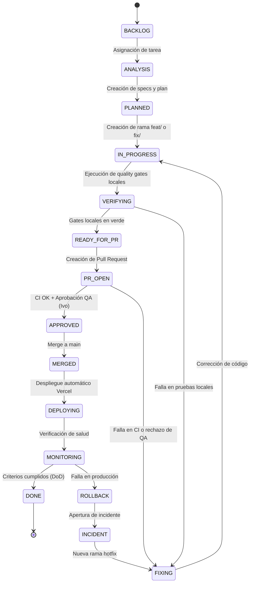
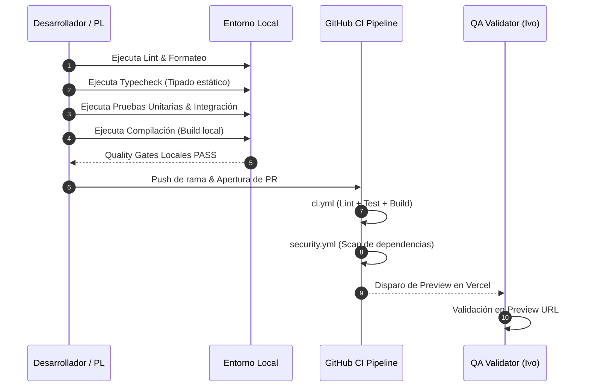

# ⚙️ Ciclo de Vida de Software y Flujo de Trabajo

Este documento define la metodología de desarrollo estandarizada del proyecto **Reportalo MVP**, basada en la skill de entrega autónoma de software ([`skills/software-delivery-workflow.md:1-35`](https://github.com/Mathiiuk/reportalo.mvp/blob/main/skills/software-delivery-workflow.md#L1-L35)).

---

## 1. Por qué existe este flujo (First Principles)

En proyectos de software ágiles, la falta de trazabilidad y validación temprana provoca despliegues defectuosos, regresiones en producción y descoordinación entre el equipo de desarrollo y QA.

Este flujo estandariza el camino:
$$\text{Requerimiento} \longrightarrow \text{Especificación} \longrightarrow \text{Rama Aislada} \longrightarrow \text{Validación Local} \longrightarrow \text{CI/Security} \longrightarrow \text{QA Preview} \longrightarrow \text{Producción}$$

---

## 2. Máquina de Estados Operativa

Toda tarea debe progresar siguiendo la máquina de estados definida en el kit ([`skills/software-delivery-workflow.md:36-65`](https://github.com/Mathiiuk/reportalo.mvp/blob/main/skills/software-delivery-workflow.md#L36-L65)).


<!-- Sources: skills/software-delivery-workflow.md:36-65, templates/task-manifest.yml:6-7 -->

---

## 3. Estructura de Tarea en `docs/workflow/`

Cada tarea formal iniciada debe crear los siguientes 4 documentos de trazabilidad ([`skills/software-delivery-workflow.md:66-78`](https://github.com/Mathiiuk/reportalo.mvp/blob/main/skills/software-delivery-workflow.md#L66-L78)):

| Documento | Ubicación | Propósito | Plantilla Origen |
| :--- | :--- | :--- | :--- |
| **Task Manifest** | `docs/workflow/tasks/<TASK-ID>.yml` | Define estado, tipo, quality gates activos y comandos | [`templates/task-manifest.yml`](https://github.com/Mathiiuk/reportalo.mvp/blob/main/templates/task-manifest.yml) |
| **Specification** | `docs/workflow/specs/<TASK-ID>.md` | Criterios de aceptación, alcance, restricciones y riesgos | [`templates/specification.md`](https://github.com/Mathiiuk/reportalo.mvp/blob/main/templates/specification.md) |
| **Implementation Plan** | `docs/workflow/plans/<TASK-ID>.md` | Archivos modificados/creados y estrategia técnica | [`templates/implementation-plan.md`](https://github.com/Mathiiuk/reportalo.mvp/blob/main/templates/implementation-plan.md) |
| **Test Plan** | `docs/workflow/tests/<TASK-ID>.md` | Casos de prueba automatizados y manuales para QA | [`templates/test-plan.md`](https://github.com/Mathiiuk/reportalo.mvp/blob/main/templates/test-plan.md) |

---

## 4. Secuencia de Validación y Quality Gates

Antes de crear un PR y durante la integración continua, se ejecutan las validaciones en orden estricto ([`skills/software-delivery-workflow.md:170-205`](https://github.com/Mathiiuk/reportalo.mvp/blob/main/skills/software-delivery-workflow.md#L170-L205)).


<!-- Sources: skills/software-delivery-workflow.md:170-205, .github/workflows/ci.yml:8-35, .github/workflows/security.yml:11-18 -->

---

## 5. Convenciones de Ramas y Commits

### Convención de Ramas
* `feat/<TASK-ID>-<slug>`: Nuevas funcionalidades (ej. `feat/REP-3304-vercel-preview`).
* `fix/<TASK-ID>-<slug>`: Corrección de errores.
* `hotfix/<INCIDENT-ID>-<slug>`: Correcciones urgentes de producción.
* `chore/<TASK-ID>-<slug>`: Mantenimiento o configuración de herramientas.

### Convención de Commits
Todos los mensajes de commit deben formularse en **español** siguiendo el estándar conventional commits:
```text
<tipo>(<módulo>): <descripción concisa>

- Detalle de cambios principales
- Referencia a ticket Jira o criterio de aceptación
```

---

## Related Pages

| Página | Relación |
| :--- | :--- |
| [Inicio (Home)](Home) | Portal general y visión de arquitectura |
| [Acta de Inicio](01-acta-de-inicio) | Requerimientos estratégicos y alcance del MVP |
| [Guía QA & Testing](03-guia-qa-testing) | Criterios para la aprobación de tareas por Ivan Juarez |
| [Roles y Gobernanza](04-roles-y-gobernanza) | Matriz RACI y responsabilidades por etapa |
| [CI/CD e Infraestructura](05-ci-cd-infraestructura) | Ejecución técnica de los pipelines en GitHub Actions |
