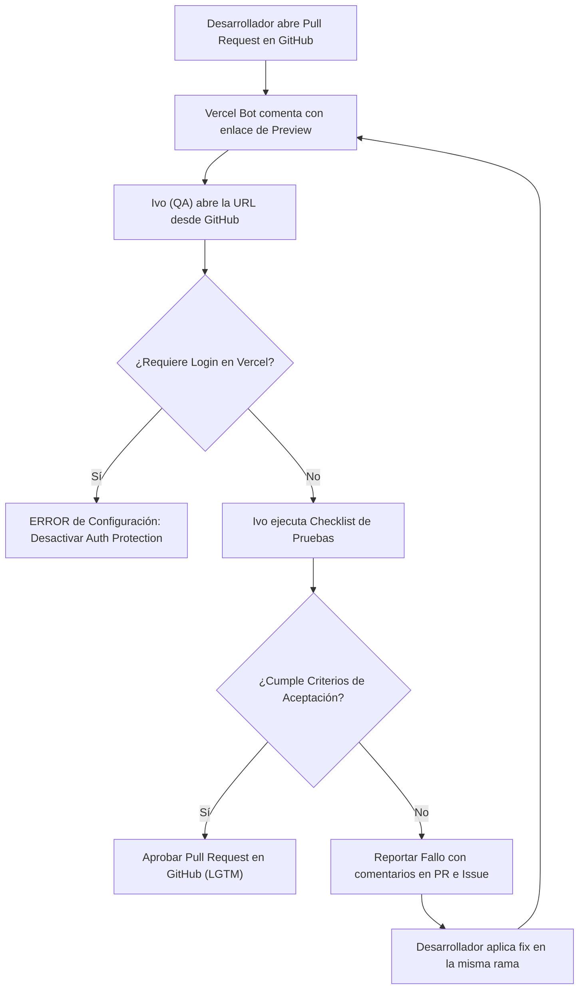
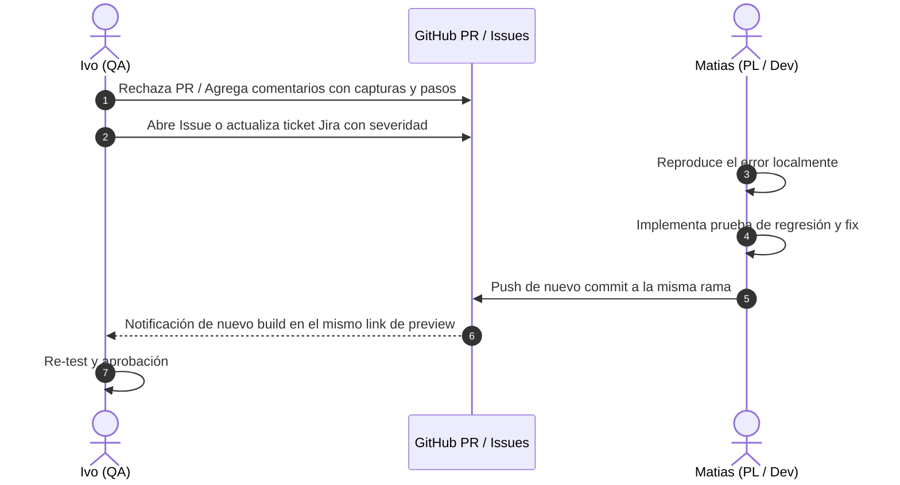

# 🧪 Guía de QA & Testing — Validación en Vercel Previews

Este documento establece el procedimiento de control de calidad para el responsable de QA (**Ivo**) y el equipo de desarrollo, enfocado en la validación en entornos efímeros de **Vercel Previews** ([`docs/workflow/guides/vercel-setup-guide.md:1-40`](https://github.com/Mathiiuk/reportalo.mvp/blob/main/docs/workflow/guides/vercel-setup-guide.md#L1-L40)).

---

## 1. Fundamento del Proceso de QA

El objetivo primordial de QA en este flujo es validar los cambios de forma visual y funcional en un entorno idéntico a producción **antes** de que el código sea integrado a la rama principal (`main`), evitando bugs en producción sin incurrir en costos de licencias en Vercel.

---

## 2. Flujo de Validación de QA

<!-- Sources: docs/workflow/guides/vercel-setup-guide.md:20-40, docs/workflow/tests/REP-3304.md:1-25 -->

---

## 3. Procedimiento Paso a Paso para QA (Ivo)

### Paso 1: Localización del Enlace de Pruebas
1. Ingresar al Pull Request asignado en [GitHub Pull Requests](https://github.com/Mathiiuk/reportalo.mvp/pulls).
2. En la conversación del PR, buscar el comentario publicado por el bot **`vercel[bot]`**.
3. Hacer clic en el enlace público bajo la etiqueta **Preview**.

### Paso 2: Ejecución del Checklist de Validación

| Ítem a Verificar | Criterio de Aceptación | Severidad en Fallo | Fuente |
| :--- | :--- | :--- | :--- |
| **Acceso Público** | La página debe abrir sin solicitar login de Vercel | Crítica (Bloqueante) | [`REP-3304.yml:23`](https://github.com/Mathiiuk/reportalo.mvp/blob/main/docs/workflow/tasks/REP-3304.yml#L23) |
| **Criterios de Jira** | La funcionalidad debe responder a los criterios especificados | Alta | [`specs/REP-3304.md:28`](https://github.com/Mathiiuk/reportalo.mvp/blob/main/docs/workflow/specs/REP-3304.md#L28) |
| **Responsive Design** | Comprobar visualización en Desktop, Tablet y Mobile | Media | [`skills/software-delivery-workflow.md:164`](https://github.com/Mathiiuk/reportalo.mvp/blob/main/skills/software-delivery-workflow.md#L164) |
| **Consola del Navegador** | No deben existir excepciones JS no controladas (HTTP 500 / errores rojos) | Alta | [`skills/software-delivery-workflow.md:28`](https://github.com/Mathiiuk/reportalo.mvp/blob/main/skills/software-delivery-workflow.md#L28) |

---

## 4. Gestión de Fallos y Reporte de Bugs

Cuando un preview no cumpla los criterios requeridos ([`skills/software-delivery-workflow.md:284-310`](https://github.com/Mathiiuk/reportalo.mvp/blob/main/skills/software-delivery-workflow.md#L284-L310)):

<!-- Sources: skills/software-delivery-workflow.md:284-310, templates/incident.md:1-20 -->

---

## 5. Definition of Done (DoD) para QA

Una tarea solo se considera **`DONE`** cuando cumple las siguientes condiciones ([`templates/definition-of-done.md:1-25`](https://github.com/Mathiiuk/reportalo.mvp/blob/main/templates/definition-of-done.md#L1-L25)):
1. Todos los casos de prueba del Test Plan pasaron exitosamente.
2. Aprobación formal de QA registrada en el Pull Request.
3. Pipelines de CI y Security en estado verde.
4. Despliegue en producción verificado.

---

## Related Pages

| Página | Relación |
| :--- | :--- |
| [Inicio (Home)](Home) | Visión general del portal |
| [Flujo de Trabajo](01-flujo-de-trabajo) | Estados de la tarea y ciclo de vida |
| [CI/CD e Infraestructura](03-ci-cd-infraestructura) | Detalles del entorno de Vercel |
| [Roles y Gobernanza](04-roles-y-gobernanza) | Responsabilidades del rol de QA |
