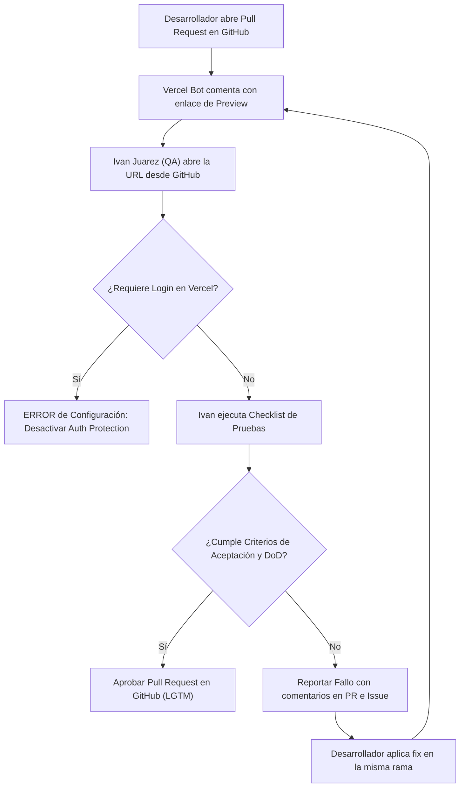
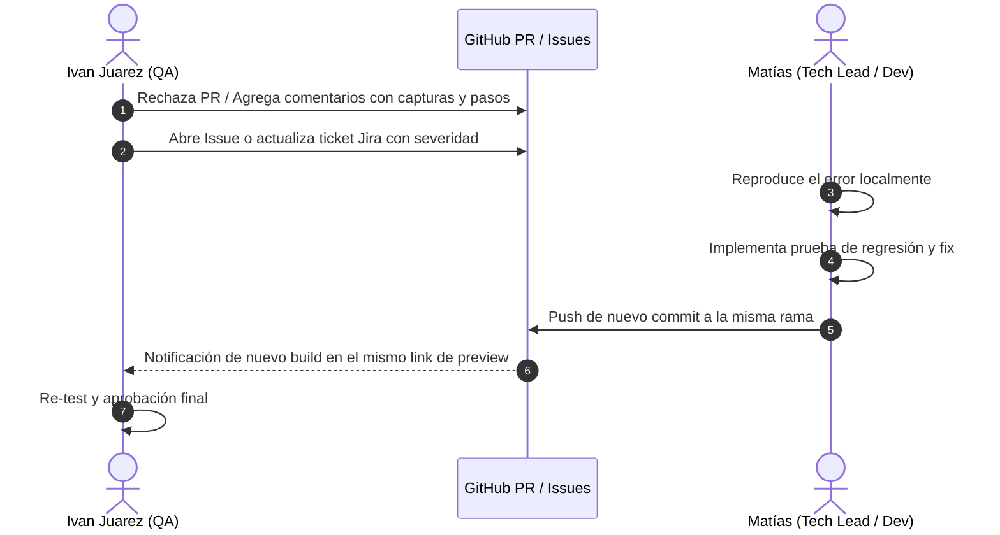

# 🧪 Guía de QA & Testing — Validación en Vercel Previews

Este documento establece el procedimiento de control de calidad para el responsable de QA (**Ivan Juarez**) y el equipo de desarrollo, enfocado en la validación en entornos efímeros de **Vercel Previews** y el cumplimiento de los umbrales de éxito del MVP ([`docs/project/acta-de-inicio-v3.md:78-86`](https://github.com/Mathiiuk/reportalo.mvp/blob/main/docs/project/acta-de-inicio-v3.md#L78-L86)).

---

## 1. Fundamento del Proceso de QA

El objetivo primordial de QA en este flujo es validar los cambios de forma visual y funcional en un entorno idéntico a producción **antes** de que el código sea integrado a la rama principal (`main`), asegurando la privacidad, accesibilidad y precisión legal sin incurrir en costos de licencias en Vercel ([`docs/workflow/guides/vercel-setup-guide.md:1-40`](https://github.com/Mathiiuk/reportalo.mvp/blob/main/docs/workflow/guides/vercel-setup-guide.md#L1-L40)).

---

## 2. Flujo de Validación de QA

<!-- Sources: docs/workflow/guides/vercel-setup-guide.md:20-40, docs/workflow/tests/REP-3304.md:1-25 -->

---

## 3. Matriz de Criterios y Umbrales de Calidad (Acta de Inicio v3.0)

| Dimensión de Prueba | Umbral Mínimo Aceptable | Severidad en Fallo | Fuente |
| :--- | :--- | :--- | :--- |
| **Fricción de Reporte** | Completar reporte en menos de 3 pasos | Alta | [`docs/project/acta-de-inicio-v3.md:80`](https://github.com/Mathiiuk/reportalo.mvp/blob/main/docs/project/acta-de-inicio-v3.md#L80) |
| **Privacidad Facial** | Anonimización / difuminado exitoso en >= 95% de casos | Bloqueante / Crítica | [`docs/project/acta-de-inicio-v3.md:81`](https://github.com/Mathiiuk/reportalo.mvp/blob/main/docs/project/acta-de-inicio-v3.md#L81) |
| **Precisión IA Jurídica** | Al menos 85% de precisión en asignación de organismo | Alta | [`docs/project/acta-de-inicio-v3.md:82`](https://github.com/Mathiiuk/reportalo.mvp/blob/main/docs/project/acta-de-inicio-v3.md#L82) |
| **Sincronización Offline** | Guardado en IndexedDB y 0% de pérdida de datos | Crítica | [`docs/project/acta-de-inicio-v3.md:83`](https://github.com/Mathiiuk/reportalo.mvp/blob/main/docs/project/acta-de-inicio-v3.md#L83) |
| **Latencia de Mapa** | Reflejo en mapa colaborativo en menos de 5 segundos | Media | [`docs/project/acta-de-inicio-v3.md:84`](https://github.com/Mathiiuk/reportalo.mvp/blob/main/docs/project/acta-de-inicio-v3.md#L84) |
| **Panel de Organismo** | Flujo completo de aprobación/rechazo con trazabilidad | Alta | [`docs/project/acta-de-inicio-v3.md:85`](https://github.com/Mathiiuk/reportalo.mvp/blob/main/docs/project/acta-de-inicio-v3.md#L85) |

---

## 4. Gestión de Fallos y Reporte de Bugs

Cuando un preview no cumpla los criterios requeridos ([`skills/software-delivery-workflow.md:284-310`](https://github.com/Mathiiuk/reportalo.mvp/blob/main/skills/software-delivery-workflow.md#L284-L310)):

<!-- Sources: skills/software-delivery-workflow.md:284-310, templates/incident.md:1-20 -->

---

## 5. Definition of Done (DoD) para QA

Una tarea solo se considera **`DONE`** cuando cumple las siguientes condiciones ([`templates/definition-of-done.md:1-25`](https://github.com/Mathiiuk/reportalo.mvp/blob/main/templates/definition-of-done.md#L1-L25)):
1. Todos los casos de prueba del Test Plan pasaron exitosamente.
2. Aprobación formal de Ivan Juarez registrada en el Pull Request.
3. Pipelines de CI y Security en estado verde.
4. Despliegue en producción verificado.

---

## Related Pages

| Página | Relación |
| :--- | :--- |
| [Inicio (Home)](Home) | Visión general del portal |
| [Acta de Inicio](01-acta-de-inicio) | Objetivos estratégicos y métricas de éxito |
| [Flujo de Trabajo](02-flujo-de-trabajo) | Estados de la tarea y ciclo de vida |
| [Roles y Gobernanza](04-roles-y-gobernanza) | Responsabilidades del rol de QA |
| [CI/CD e Infraestructura](05-ci-cd-infraestructura) | Detalles del entorno de Vercel |
