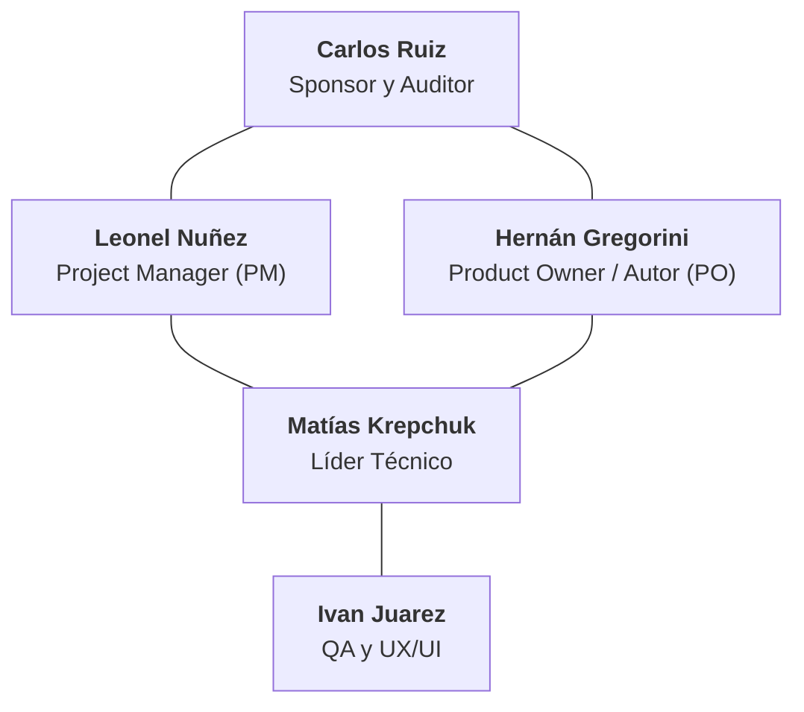
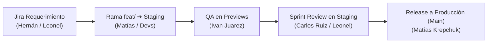

# 👥 Roles y Gobernanza del Proyecto

Este documento establece la conformación oficial del equipo, responsabilidades, normas de gobernanza técnica y flujo de promoción entre entornos para el desarrollo de **Reportalo (RAR-2026)** ([`docs/project/acta-de-inicio-v3.md:14-25`](https://github.com/Mathiiuk/reportalo.mvp/blob/main/docs/project/acta-de-inicio-v3.md#L14-L25)).

---

## 1. Estructura Oficial del Equipo

<!-- Sources: docs/project/acta-de-inicio-v3.md:14-25, docs/project/acta-de-inicio-v3.md:88-96 -->

---

## 2. Descripción de Roles y Atribuciones

| Integrante | Rol Oficial | Responsabilidades Clave | Fuente |
| :--- | :--- | :--- | :--- |
| **Carlos Ruiz** | **Sponsor y Auditor** | Define criterios de aceptación estratégicos; valida las versiones de Sprint en Staging y aprueba el pase a producción. | [`docs/project/acta-de-inicio-v3.md:90`](https://github.com/Mathiiuk/reportalo.mvp/blob/main/docs/project/acta-de-inicio-v3.md#L90) |
| **Leonel Nuñez** | **Project Manager (PM)** | Planificación, gestión de tiempos, remoción de bloqueos y coordinación de ceremonias ágiles. | [`docs/project/acta-de-inicio-v3.md:91`](https://github.com/Mathiiuk/reportalo.mvp/blob/main/docs/project/acta-de-inicio-v3.md#L91) |
| **Hernán Gregorini** | **Product Owner (PO) / Autor** | Definición de backlog, redacción y priorización de historias de usuario, valor para ciudadano y organismo. | [`docs/project/acta-de-inicio-v3.md:93`](https://github.com/Mathiiuk/reportalo.mvp/blob/main/docs/project/acta-de-inicio-v3.md#L93) |
| **Matías Krepchuk** | **Líder Técnico** | Arquitectura del sistema, desarrollo core, code review, CI/CD y único responsable autorizado para merge a `main`. | [`docs/project/acta-de-inicio-v3.md:92`](https://github.com/Mathiiuk/reportalo.mvp/blob/main/docs/project/acta-de-inicio-v3.md#L92) |
| **Ivan Juarez** | **QA y UX/UI** | Aseguramiento de calidad, pruebas en Previews y dispositivos reales, y aprobación de PRs hacia `staging`. | [`docs/project/acta-de-inicio-v3.md:94`](https://github.com/Mathiiuk/reportalo.mvp/blob/main/docs/project/acta-de-inicio-v3.md#L94) |

---

## 3. Matriz RACI del Ciclo de Desarrollo y Promoción

<!-- Sources: docs/project/acta-de-inicio-v3.md:88-96, CONTRIBUTING.md:1-50 -->

| Actividad / Hito | Carlos (Sponsor) | Leonel (PM) | Hernán (PO) | Matías (Tech Lead) | Ivan (QA/UX) |
| :--- | :---: | :---: | :---: | :---: | :---: |
| **Definición de Alcance e Historias** | **I** | **C** | **A / R** | **C** | **C** |
| **Sprint Planning & Estimaciones** | **I** | **A / R** | **C** | **R** | **R** |
| **Arquitectura y Core Development** | **I** | **I** | **I** | **A / R** | **I** |
| **Diseño UX/UI y Accesibilidad** | **C** | **I** | **A** | **C** | **R** |
| **Validación en Vercel Previews** | **I** | **I** | **C** | **I** | **A / R** |
| **Merge a Staging** | **I** | **I** | **I** | **A / R** | **A** (Aprobación) |
| **Sprint Review en Staging** | **A / R** | **A / R** | **C** | **I** | **I** |
| **Release a Producción (Merge a main)** | **A** | **C** | **C** | **R** (Único) | **I** |

> **Leyenda RACI**: **R** = Responsable de ejecución, **A** = Aprobador final (Accountable), **C** = Consultado, **I** = Informado.

---

## 4. Políticas de Gobernanza y Convenciones

1. **Gestión de Tareas**: Toda tarea nace con un identificador de Jira (`REP-XXXX`), su manifest en `docs/workflow/tasks/` y registro en `resume.md`.
2. **Convención de Ramas**: `feat/<ID>-slug`, `fix/<ID>-slug`, `hotfix/<ID>-slug` (creadas siempre a partir de `staging`).
3. **Commits en Español**: Formato Conventional Commits descriptivo.
4. **Plantillas Oficiales**: Todo PR y reporte de bug debe utilizar las plantillas obligatorias en [`.github/PULL_REQUEST_TEMPLATE.md`](https://github.com/Mathiiuk/reportalo.mvp/blob/main/.github/PULL_REQUEST_TEMPLATE.md) e [`.github/ISSUE_TEMPLATE/`](https://github.com/Mathiiuk/reportalo.mvp/blob/main/.github/ISSUE_TEMPLATE/).

---

## Related Pages

| Página | Relación |
| :--- | :--- |
| [Inicio (Home)](Home) | Portal general de la Wiki |
| [Acta de Inicio](01-acta-de-inicio) | Visión y compromisos estratégicos del proyecto |
| [Flujo de Trabajo](02-flujo-de-trabajo) | Metodología de entrega y máquina de estados |
| [Guía QA & Testing](03-guia-qa-testing) | Procedimientos de prueba para Ivan Juarez |
| [CI/CD e Infraestructura](05-ci-cd-infraestructura) | Pipelines y arquitectura de 3 entornos |
