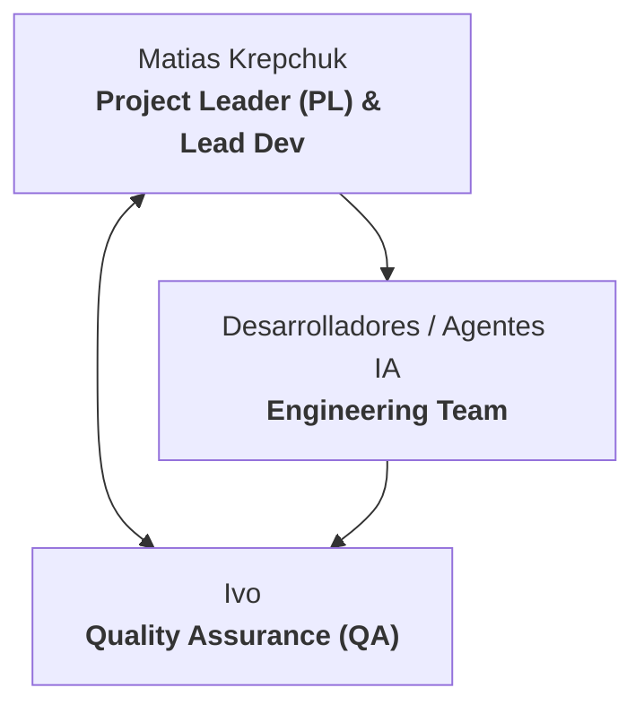
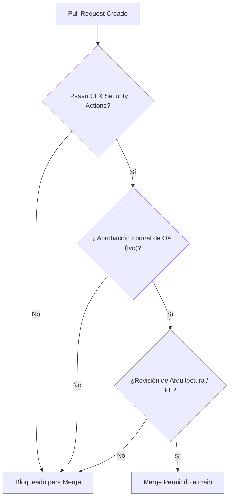

# 👥 Roles y Gobernanza del Proyecto

Este documento establece la estructura organizativa, responsabilidades del equipo y normas de gobernanza técnica para el desarrollo del proyecto **Reportalo MVP** ([`skills/software-delivery-workflow.md:23-35`](https://github.com/Mathiiuk/reportalo.mvp/blob/main/skills/software-delivery-workflow.md#L23-L35)).

---

## 1. Estructura de Roles y Equipo

<!-- Sources: docs/workflow/tasks/REP-3304.yml:8, docs/workflow/specs/REP-3304.md:1-15 -->

---

## 2. Matriz RACI de Responsabilidades

| Etapa del Ciclo de Vida | Matias (PL) | Ivo (QA) | Desarrolladores / Agentes | Fuente |
| :--- | :---: | :---: | :---: | :--- |
| **Definición de Requerimientos (Jira)** | **A / R** | **C** | **I** | [`specs/REP-3304.md:1`](https://github.com/Mathiiuk/reportalo.mvp/blob/main/docs/workflow/specs/REP-3304.md#L1) |
| **Implementación de Código y Ramas** | **A** | **I** | **R** | [`plans/REP-3304.md:1`](https://github.com/Mathiiuk/reportalo.mvp/blob/main/docs/workflow/plans/REP-3304.md#L1) |
| **Validación en Vercel Previews** | **I** | **R / A** | **C** | [`tests/REP-3304.md:1`](https://github.com/Mathiiuk/reportalo.mvp/blob/main/docs/workflow/tests/REP-3304.md#L1) |
| **Aprobación de Pull Requests** | **A** | **R** | **C** | [`software-delivery-workflow.md:210`](https://github.com/Mathiiuk/reportalo.mvp/blob/main/skills/software-delivery-workflow.md#L210) |
| **Despliegue a Producción (Merge)** | **R / A** | **I** | **I** | [`software-delivery-workflow.md:248`](https://github.com/Mathiiuk/reportalo.mvp/blob/main/skills/software-delivery-workflow.md#L248) |

> **Leyenda RACI**: **R** = Responsable de ejecución, **A** = Aprobador final (Accountable), **C** = Consultado, **I** = Informado.

---

## 3. Políticas de Pull Requests y Merge

<!-- Sources: skills/software-delivery-workflow.md:224-247, templates/pull-request.md:1-15 -->

---

## 4. Reglas No Negociables del Repositorio

1. **No direct-push a `main`**: Todo cambio ingresa por rama y Pull Request.
2. **Sin secretos en el código**: Credenciales y tokens se configuran en GitHub Secrets y Vercel Environment Variables.
3. **Commits en Español**: Siguiendo formato conventional commits.
4. **Trazabilidad Obligatoria**: Toda tarea debe tener su manifest en `docs/workflow/tasks/` y registro en `resume.md`.

---

## Related Pages

| Página | Relación |
| :--- | :--- |
| [Inicio (Home)](Home) | Portal principal |
| [Flujo de Trabajo](01-flujo-de-trabajo) | Metodología de entrega |
| [Guía QA & Testing](02-guia-qa-testing) | Criterios de evaluación de QA |
| [CI/CD e Infraestructura](03-ci-cd-infraestructura) | Pipelines y automatización |
