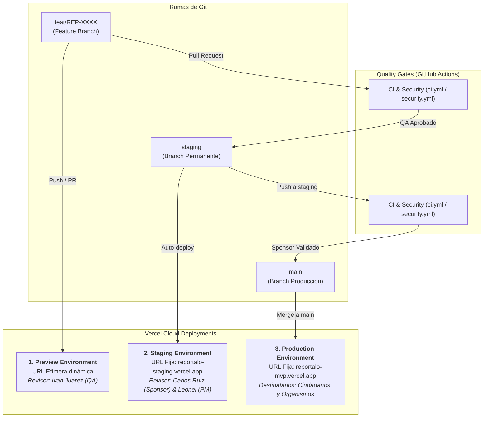

# 🚀 CI/CD e Infraestructura

Este documento describe la arquitectura de Integración y Despliegue Continuo (CI/CD) implementada en el repositorio **`Mathiiuk/reportalo.mvp`**, combinando **GitHub Actions** y **Vercel** para operar **3 entornos diferenciados** ([`skills/software-delivery-workflow.md:224-270`](https://github.com/Mathiiuk/reportalo.mvp/blob/main/skills/software-delivery-workflow.md#L224-L270)).

---

## 1. Topología de los 3 Entornos


<!-- Sources: .github/workflows/ci.yml:3-7, .github/workflows/security.yml:3-7, docs/workflow/guides/staging-setup-guide.md:1-35 -->

---

## 2. Comparativa de Entornos

| Entorno | Rama Git | Tipo de URL | Acceso / Destinatario | Calidad / Estabilidad |
| :--- | :--- | :--- | :--- | :--- |
| **Preview** | `feat/<ID>-slug` | Dinámica por PR | **Ivan Juarez (QA)** | Código en desarrollo activo, pruebas unitarias y de integración de cada tarea. |
| **Staging** | `staging` | **Fija y Permanente** | **Carlos Ruiz (Sponsor)** & **Leonel (PM)** | Versión congelada y consolidada de Sprint para demos y validación de hitos. |
| **Producción** | `main` | **Fija y Permanente** | **Ciudadanos y Organismos Públicos** | Versión oficial del MVP para CABA y Avellaneda. |

---

## 3. Mapa de Pipelines y Workflows

| Workflow | Archivo Fuente | Eventos Disparadores | Propósito |
| :--- | :--- | :--- | :--- |
| **CI Quality Suite** | [`.github/workflows/ci.yml:1`](https://github.com/Mathiiuk/reportalo.mvp/blob/main/.github/workflows/ci.yml#L1) | `pull_request`, `push (main, staging)` | Validación de tipado, linting, tests y compilación |
| **Security Scan** | [`.github/workflows/security.yml:1`](https://github.com/Mathiiuk/reportalo.mvp/blob/main/.github/workflows/security.yml#L1) | `pull_request`, `push (main, staging)` | Auditoría de vulnerabilidades y SAST |
| **Deploy Staging / Prod** | [`.github/workflows/deploy-template.yml:1`](https://github.com/Mathiiuk/reportalo.mvp/blob/main/.github/workflows/deploy-template.yml#L1) | `workflow_dispatch` | Template de despliegue y smoke tests |
| **Wiki Sync Engine** | [`.github/workflows/wiki-sync.yml:1`](https://github.com/Mathiiuk/reportalo.mvp/blob/main/.github/workflows/wiki-sync.yml#L1) | `push (main en wiki/**)` | Publicación automática a la GitHub Wiki |

---

## 4. Configuración de Vercel ([`vercel.json`](https://github.com/Mathiiuk/reportalo.mvp/blob/main/vercel.json))

```json
{
  "$schema": "https://openapi.vercel.sh/vercel.json",
  "version": 2,
  "cleanUrls": true,
  "trailingSlash": false
}
```

* **URLs Limpias**: Habilita URLs amigables sin extensión `.html`.
* **Cero Acoplamiento**: Soporta la asignación de dominios dedicados por rama en el panel de Vercel (`reportalo-staging.vercel.app` para `staging`).

---

## Related Pages

| Página | Relación |
| :--- | :--- |
| [Inicio (Home)](Home) | Portal general |
| [Acta de Inicio](01-acta-de-inicio) | Requerimientos estratégicos del MVP |
| [Flujo de Trabajo](02-flujo-de-trabajo) | Máquina de estados de desarrollo |
| [Guía QA & Testing](03-guia-qa-testing) | Validación de despliegues por Ivan Juarez |
| [Roles y Gobernanza](04-roles-y-gobernanza) | Control de cambios y accesos |
