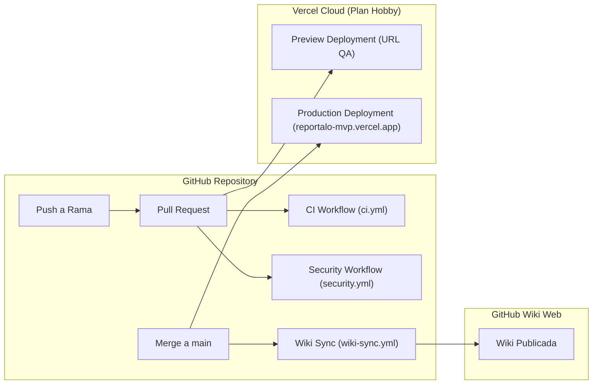

# 🚀 CI/CD e Infraestructura

Este documento describe la arquitectura de Integración y Despliegue Continuo (CI/CD) implementada en el repositorio **`Mathiiuk/reportalo.mvp`**, combinando **GitHub Actions** y **Vercel** ([`skills/software-delivery-workflow.md:224-270`](https://github.com/Mathiiuk/reportalo.mvp/blob/main/skills/software-delivery-workflow.md#L224-L270)).

---

## 1. Mapa de Pipelines y Workflows

| Workflow | Archivo Fuente | Eventos Disparadores | Propósito |
| :--- | :--- | :--- | :--- |
| **CI Quality Suite** | [`.github/workflows/ci.yml:1`](https://github.com/Mathiiuk/reportalo.mvp/blob/main/.github/workflows/ci.yml#L1) | `pull_request`, `push (main)` | Validación de tipado, linting, tests y compilación |
| **Security Scan** | [`.github/workflows/security.yml:1`](https://github.com/Mathiiuk/reportalo.mvp/blob/main/.github/workflows/security.yml#L1) | `pull_request`, `push (main)` | Auditoría de vulnerabilidades y SAST |
| **Deploy Staging / Prod** | [`.github/workflows/deploy-template.yml:1`](https://github.com/Mathiiuk/reportalo.mvp/blob/main/.github/workflows/deploy-template.yml#L1) | `workflow_dispatch` | Template de despliegue a staging con smoke tests |
| **Wiki Sync Engine** | [`.github/workflows/wiki-sync.yml:1`](https://github.com/Mathiiuk/reportalo.mvp/blob/main/.github/workflows/wiki-sync.yml#L1) | `push (main en wiki/**)` | Publicación automática a la GitHub Wiki |

---

## 2. Topología de Integración


<!-- Sources: .github/workflows/ci.yml:3-6, .github/workflows/security.yml:3-6, vercel.json:1-6 -->

---

## 3. Detalle de los Workflows

### A. Pipeline de Calidad ([`ci.yml`](https://github.com/Mathiiuk/reportalo.mvp/blob/main/.github/workflows/ci.yml))
Ejecuta secuencialmente los quality gates obligatorios:
1. `Setup runtime`
2. `Install dependencies`
3. `Lint`
4. `Typecheck`
5. `Unit tests`
6. `Integration tests`
7. `Build`

### B. Pipeline de Seguridad ([`security.yml`](https://github.com/Mathiiuk/reportalo.mvp/blob/main/.github/workflows/security.yml))
Configurado con permisos de solo lectura (`contents: read`) para analizar dependencias y mitigar riesgos de seguridad antes del merge.

### C. Pipeline de Sincronización de Wiki ([`wiki-sync.yml`](https://github.com/Mathiiuk/reportalo.mvp/blob/main/.github/workflows/wiki-sync.yml))
Sincroniza en tiempo real los cambios del directorio `wiki/` con el repositorio Git de la Wiki oficial de GitHub.

---

## 4. Configuración de Vercel ([`vercel.json`](https://github.com/Mathiiuk/reportalo.mvp/blob/main/vercel.json))

```json
{
  "$schema": "https://openapi.vercel.sh/vercel.json",
  "version": 2,
  "cleanUrls": true,
  "trailingSlash": false
}
```

* **URLs Limpias**: Habilita URLs sin extensión `.html`.
* **Cero Configuración Acoplada**: Compatible con Next.js, Vite, Astro o cualquier stack que se incorpore.

---

## Related Pages

| Página | Relación |
| :--- | :--- |
| [Inicio (Home)](Home) | Portal general |
| [Acta de Inicio](01-acta-de-inicio) | Requerimientos estratégicos del MVP |
| [Flujo de Trabajo](02-flujo-de-trabajo) | Máquina de estados de desarrollo |
| [Guía QA & Testing](03-guia-qa-testing) | Validación de despliegues por Ivan Juarez |
| [Roles y Gobernanza](04-roles-y-gobernanza) | Control de cambios y accesos |
