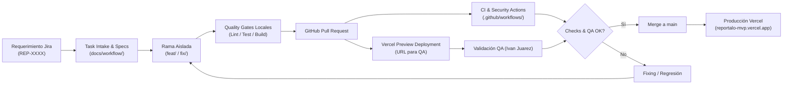
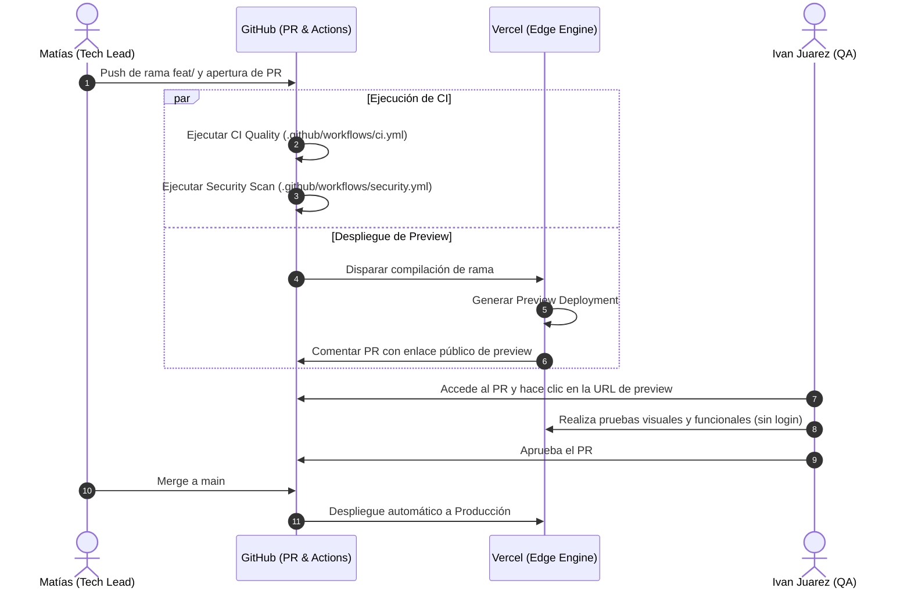

# 🚀 Reportalo — Plataforma de Auditoría Ciudadana con IA Jurídica

Bienvenido a la documentación oficial y técnica del proyecto **Reportalo** (Código: `RAR-2026`). Este portal centraliza las normas de desarrollo, arquitectura de despliegue, procedimientos de prueba para QA y estándares de ingeniería ([`docs/project/acta-de-inicio-v3.md:1-12`](https://github.com/Mathiiuk/reportalo.mvp/blob/main/docs/project/acta-de-inicio-v3.md#L1-L12)).

---

## 1. Visión General del Proyecto

| Componente | Descripción | Estado | Fuente |
| :--- | :--- | :--- | :--- |
| **Proyecto** | Reportalo (Auditoría Ciudadana con IA Jurídica) | En Desarrollo (MVP Dic 2026) | [`docs/project/acta-de-inicio-v3.md:1`](https://github.com/Mathiiuk/reportalo.mvp/blob/main/docs/project/acta-de-inicio-v3.md#L1) |
| **Código Interno** | `RAR-2026` &bull; Alcance: CABA y Avellaneda | Activo | [`docs/project/acta-de-inicio-v3.md:7-8`](https://github.com/Mathiiuk/reportalo.mvp/blob/main/docs/project/acta-de-inicio-v3.md#L7-L8) |
| **Delivery Skill** | Flujo de entrega autónomo estandarizado | v2.0.0 | [`skills/software-delivery-workflow.md:1`](https://github.com/Mathiiuk/reportalo.mvp/blob/main/skills/software-delivery-workflow.md#L1) |
| **Infraestructura** | Vercel (Plan Hobby/Free) + GitHub Actions | Operativo | [`vercel.json:1`](https://github.com/Mathiiuk/reportalo.mvp/blob/main/vercel.json#L1) |
| **Bitácora** | Historial de entregas y decisiones técnicas | Actualizado | [`resume.md:1`](https://github.com/Mathiiuk/reportalo.mvp/blob/main/resume.md#L1) |

---

## 2. Arquitectura de Ciclo de Vida de Software

El proyecto opera bajo un modelo de entrega continua basado en evidencias, desde la concepción de la tarea en Jira hasta el despliegue verificado en producción ([`skills/software-delivery-workflow.md:15-35`](https://github.com/Mathiiuk/reportalo.mvp/blob/main/skills/software-delivery-workflow.md#L15-L35)).

<!-- Sources: skills/software-delivery-workflow.md:38-64, docs/workflow/tasks/REP-3304.yml:1-49 -->

---

## 3. Secuencia de Integración y Despliegue

La interacción entre el Líder Técnico (**Matías**), la infraestructura de **Vercel** y el responsable de QA (**Ivan**) garantiza que ningún cambio llegue a producción sin validación visual y funcional previa ([`docs/workflow/guides/vercel-setup-guide.md:20-40`](https://github.com/Mathiiuk/reportalo.mvp/blob/main/docs/workflow/guides/vercel-setup-guide.md#L20-L40)).

<!-- Sources: docs/workflow/guides/vercel-setup-guide.md:20-40, .github/workflows/ci.yml:1-35, .github/workflows/security.yml:1-18 -->

---

## 4. Índice de Documentación de la Wiki

| Sección | Descripción | Destinatario Principal | Enlace |
| :--- | :--- | :--- | :--- |
| **01. Acta de Inicio v3.0** | Visión del producto, alcance MVP, exclusiones, matriz de organismos y métricas | Todo el equipo / Sponsor | [Ver Página](01-acta-de-inicio) |
| **02. Flujo de Trabajo** | Metodología de desarrollo, máquina de estados y quality gates | Engineering Team | [Ver Página](02-flujo-de-trabajo) |
| **03. Guía QA & Testing** | Manual de validación de Previews en Vercel y checklist de testing | QA (Ivan) / Devs | [Ver Página](03-guia-qa-testing) |
| **04. Roles y Gobernanza** | Equipo oficial, matriz RACI y políticas de PRs | Todo el equipo | [Ver Página](04-roles-y-gobernanza) |
| **05. CI/CD e Infraestructura** | Detalle de GitHub Actions, sintaxis de pipelines y Vercel | DevOps / Tech Lead | [Ver Página](05-ci-cd-infraestructura) |

---

## Related Pages

| Página | Relación |
| :--- | :--- |
| [Acta de Inicio v3.0](01-acta-de-inicio) | Marco estratégico y requerimientos funcionales del MVP |
| [Flujo de Trabajo](02-flujo-de-trabajo) | Máquina de estados completa y ciclo de vida de tareas |
| [Guía QA & Testing](03-guia-qa-testing) | Procedimiento de validación paso a paso para Ivan Juarez |
| [Roles y Gobernanza](04-roles-y-gobernanza) | Matriz RACI y responsabilidades del equipo |
| [CI/CD e Infraestructura](05-ci-cd-infraestructura) | Configuración de GitHub Actions y despliegues en Vercel |
