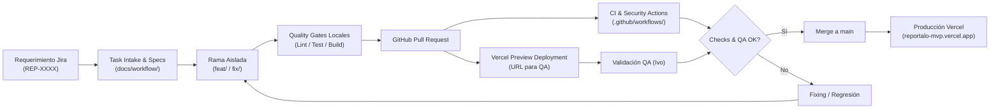
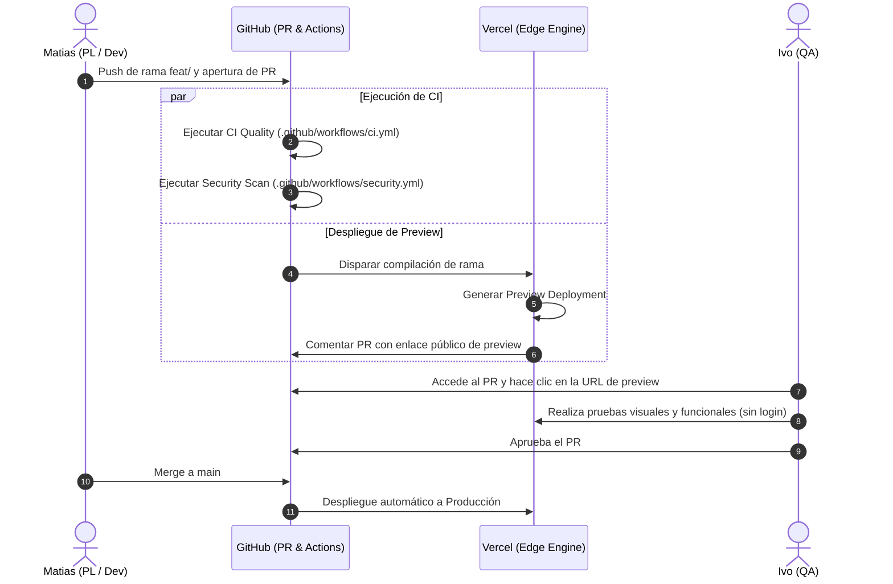
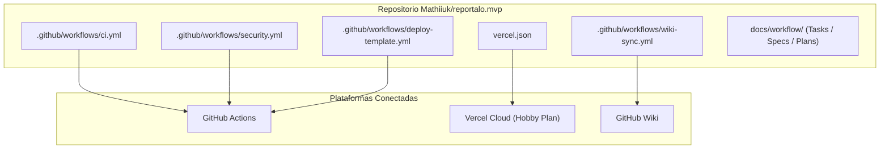

# 🚀 Reportalo MVP — Portal de Documentación

Bienvenido a la documentación oficial y técnica del proyecto **Reportalo MVP**. Este portal centraliza las normas de desarrollo, arquitectura de despliegue, procedimientos de prueba para QA y estándares de ingeniería.

---

## 1. Visión General del Proyecto

| Componente | Descripción | Estado | Fuente |
| :--- | :--- | :--- | :--- |
| **Repositorio** | `Mathiiuk/reportalo.mvp` | Activo | [`README.md:1`](https://github.com/Mathiiuk/reportalo.mvp/blob/main/README.md#L1) |
| **Delivery Skill** | Flujo de entrega autónomo estandarizado | v2.0.0 | [`skills/software-delivery-workflow.md:1`](https://github.com/Mathiiuk/reportalo.mvp/blob/main/skills/software-delivery-workflow.md#L1) |
| **Infraestructura** | Vercel (Plan Hobby/Free) + GitHub Actions | Operativo | [`vercel.json:1`](https://github.com/Mathiiuk/reportalo.mvp/blob/main/vercel.json#L1) |
| **Bitácora** | Historial de entregas y decisiones técnicas | Actualizado | [`resume.md:1`](https://github.com/Mathiiuk/reportalo.mvp/blob/main/resume.md#L1) |

---

## 2. Arquitectura de Ciclo de Vida de Software

El proyecto opera bajo un modelo de entrega continua basado en evidencias, desde la concepción de la tarea en Jira hasta el despliegue verificado en producción ([`skills/software-delivery-workflow.md:15-35`](https://github.com/Mathiiuk/reportalo.mvp/blob/main/skills/software-delivery-workflow.md#L15-L35)).

<!-- Sources: skills/software-delivery-workflow.md:38-64, docs/workflow/tasks/REP-3304.yml:1-49 -->

---

## 3. Secuencia de Integración y Despliegue

La interacción entre el Project Leader (**Matias**), la infraestructura de **Vercel** y el equipo de QA (**Ivo**) garantiza que ningún cambio llegue a producción sin validación visual y funcional previa ([`docs/workflow/guides/vercel-setup-guide.md:20-40`](https://github.com/Mathiiuk/reportalo.mvp/blob/main/docs/workflow/guides/vercel-setup-guide.md#L20-L40)).

<!-- Sources: docs/workflow/guides/vercel-setup-guide.md:20-40, .github/workflows/ci.yml:1-35, .github/workflows/security.yml:1-18 -->

---

## 4. Estado de los Componentes y Workflows

<!-- Sources: .github/workflows/ci.yml:1-35, .github/workflows/security.yml:1-18, vercel.json:1-6 -->

---

## 5. Índice de Documentación de la Wiki

| Sección | Descripción | Destinatario Principal | Enlace |
| :--- | :--- | :--- | :--- |
| **01. Flujo de Trabajo** | Metodología de desarrollo, máquina de estados y quality gates | Todo el equipo | [Ver Página](01-flujo-de-trabajo) |
| **02. Guía QA & Testing** | Manual de validación de Previews en Vercel y checklist de testing | QA (Ivo) / PL | [Ver Página](02-guia-qa-testing) |
| **03. CI/CD e Infra** | Detalle de GitHub Actions, sintaxis de pipelines y Vercel | DevOps / PL | [Ver Página](03-ci-cd-infraestructura) |
| **04. Roles y Gobernanza** | Matriz RACI, políticas de PRs, issues y commits | Todo el equipo | [Ver Página](04-roles-y-gobernanza) |

---

## Related Pages

| Página | Relación |
| :--- | :--- |
| [Flujo de Trabajo](01-flujo-de-trabajo) | Detalla la máquina de estados completa y ciclo de vida de tareas |
| [Guía QA & Testing](02-guia-qa-testing) | Procedimiento de validación paso a paso para Ivo |
| [CI/CD e Infraestructura](03-ci-cd-infraestructura) | Configuración de GitHub Actions y despliegues en Vercel |
| [Roles y Gobernanza](04-roles-y-gobernanza) | Responsabilidades del equipo y políticas de contribución |
